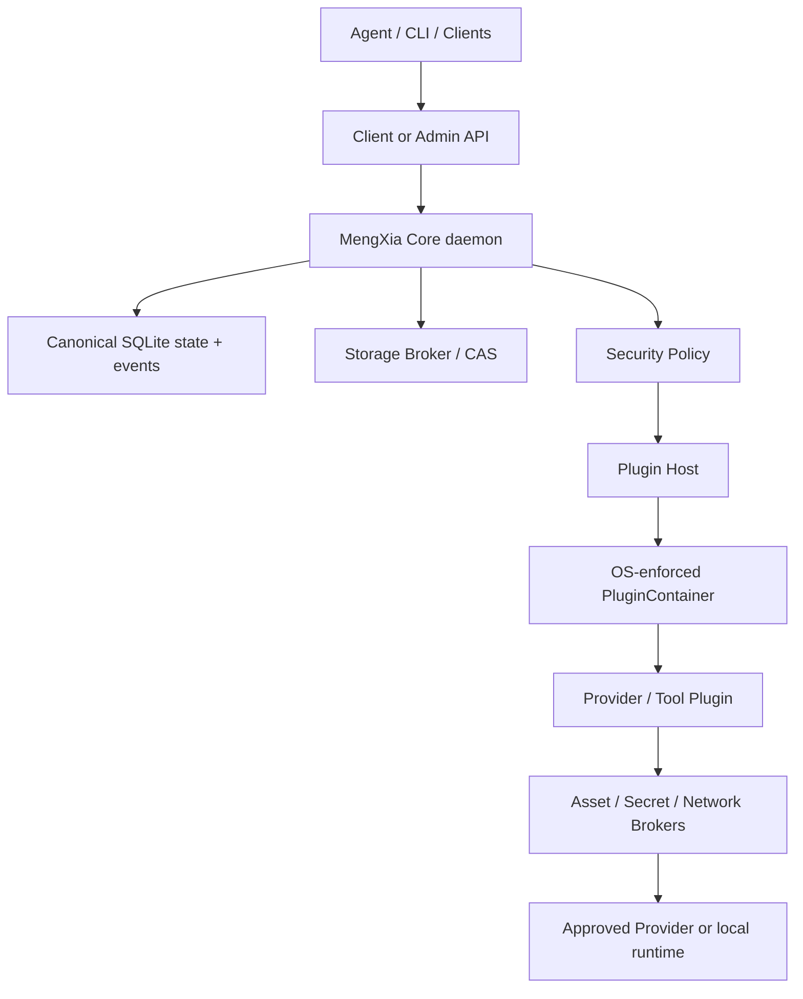

# 梦夏（MengXia）Canonical Implementation Specification

> 本文件是梦夏当前实现规范的主要 Source of Truth。除非存在已接受 ADR 或更高优先级的明确项目决策，Codex 必须按本文件实施。

## 0. Document Contract

### 0.1 Normative language

`MUST`、`MUST NOT`、`SHOULD`、`SHOULD NOT`、`MAY` 为规范性关键词。

| Status | Meaning | Codex behavior |
|---|---|---|
| `CONFIRMED` | 已确认且具有约束力 | 不得擅自改变；变更前必须提交 ADR |
| `PROPOSED` | 基于研究推导出的实施默认值，尚未声明为长期冻结原则 | 非阻塞时按该默认值实施；若仓库现实冲突，先记录并提交 ADR |
| `OPEN` | 尚无最终决定 | `Blocking: YES` 时停止依赖该决定的工作；否则使用列出的 safe default |
| `DEPRECATED` | 已明确废弃 | 不得重新引入 |
| `TBD` | 需要基准测试或外部事实才能确定的数值 | 不得编造；先插桩、测量，再通过 ADR/规范更新确定 |

### 0.2 Information authority

冲突按以下优先级处理：

1. 用户明确确认的项目决策与本文件中的 `CONFIRMED` 条目。
2. 当前最新项目规范。
3. 官方协议、标准、Provider 文档和官方仓库。
4. 已验证的 Deep Research 结论。
5. 当前代码库的实际实现。
6. 早期讨论、探索性聊天和旧草稿。

代码库现实可以证明“当前实现是什么”，不能自动推翻“目标实现必须是什么”。发现冲突时，Codex MUST 在变更说明或 ADR 中使用：

```text
CONFLICT:
Source A:
Source B:
Recommended canonical decision:
Reason:
Impact:
```

### 0.3 Evidence classification

| Label | Meaning |
|---|---|
| `FACT` | 来源直接陈述或仓库可观察事实 |
| `RESEARCH CONCLUSION` | 多个资料经核验后的技术结论 |
| `DECISION` | 项目已确认的规范性选择 |
| `RECOMMENDATION` | 研究推导的建议，未自动升级为冻结原则 |
| `INFERENCE` | 基于现有事实作出的推断，需验证 |

### 0.4 Current task parameters

| Parameter | Value | Status |
|---|---|---|
| Project | 梦夏 / MengXia | `CONFIRMED` |
| Repository | TASK-001/TASK-002 已完成；workspace 现有 18 个 canonical package；TASK-004 bootstrap schema/migration、SQLite/path/ACL/owner/lock/intent/recovery/WAL/corruption/bounded lifecycle 实现与 14 个本地 gate 已通过，正式 reviewed CI attestation 尚未产生；IPC、CAS 与产品能力仍不存在 | `FACT` |
| Primary stack | Rust、Tokio、SQLite、proto3、JSON Schema 2020-12、Cargo Workspace | `CONFIRMED V1` |
| Scope | local-first、vendor-neutral 的生成式资产图与生产运行时 V1 | `CONFIRMED` |
| Initial users | 个人创作者、小团队、Agent-heavy 用户 | `CONFIRMED` |
| First production scenario | AI 短片、广告与视觉内容工作流 | `CONFIRMED` |
| Current stage | Implementation；TASK-001 and TASK-002 verified complete；TASK-004 is authorized IN_PROGRESS under its exact accepted contract/start record so it can create durable Library owner/lock context before TASK-003; TASK-003 and later tasks remain unauthorized | `FACT / DECISION` |

### 0.5 Stable verification identifiers

- `AC-NNN` identifies a normative acceptance behavior. Once published, an AC ID MUST NOT be renumbered or reused; incompatible replacement adds a new ID and records supersession.
- `TEST-<AREA>-NNN` identifies one reproducible verification obligation. The specification MAY define a TEST ID before its repository command exists. Before the owning task becomes `DONE`, the repository MUST map that ID to an executable command, test target or deterministic repository check and retain per-ID evidence.
- Before a task becomes `IN_PROGRESS`, its task-start record MUST reference at least one Feature ID, one Requirement ID, one `AC-*` ID and one `TEST-*` ID already defined in the canonical documents. Creating the command that implements a TEST obligation MAY occur inside that task. Natural-language labels such as “smoke build”, “security tests” or “architecture test” supplement but never replace stable IDs.
- A task cannot become `DONE` unless every referenced AC and TEST ID has recorded PASS evidence, or an explicit accepted gate marks the capability unsupported/disabled. Missing, skipped or unverifiable evidence is not PASS.
- For traceability purposes, a task is active only when its status is `IN_PROGRESS` or `DONE`; `PENDING / NEXT` is additionally required to carry the identifier set before implementation begins. Blocked/PENDING future tasks MAY receive their stable AC/TEST registry at their task-start gate after open decisions close.
- `TEST-DOC-001` covers the normative namespaces `G/FUNC/REQ/DATA/API/SEC/REL/PERF/OPS/CFG/AC/TEST/TASK/OQ/DEC/RISK/SRC/ADR/BASE/CONFLICT/REVIEW/BASELINE`. Each namespace has one canonical definition site; references elsewhere do not redefine an ID. Traceability MUST reject duplicate canonical definitions, unknown references, malformed ranges and lifecycle-active tasks without the required identifier classes.
- A range is presentation shorthand only. It MUST repeat the namespace at both endpoints (for example `AC-001..AC-006`), expand to existing IDs in numeric order and MUST NOT be used in a task-start or completion evidence record, where IDs are enumerated individually.

## Executive Summary

梦夏是一个 local-first、vendor-neutral 的生成式资产图与生产运行时。V1 先证明三件事：Core 能可靠拥有并验证资产；生产任务能在崩溃后从 durable state 恢复；扩展代码即使不可信，也不能绕过 Core 对主机、资产、Credential 和网络外传的控制。实现顺序必须先完成仓库/类型/IPC/SQLite/CAS/ingest，再完成 Plugin package、独立权限域、OS-enforced sandbox、Lease/Broker，最后才接入真实 Provider Credential 和网络。

当前已有 TASK-001 建立的 Cargo workspace、crate/binary 边界、CI 与仓库验证基础设施，以及 TASK-002 已验证的 foundation value/error baseline。TASK-004 的 bootstrap schema/migration、固定 SQLite、macOS path/ACL authority、durable owner/lock/intent/recovery、WAL/corruption matrix 与 bounded lifecycle 已实现，全部 14 个本地 gate 在 exact tuple 下通过；只有正式 reviewed CI attestation 尚未产生，因此 TASK-004 仍为 `IN_PROGRESS`，不得宣称 AC-065、TEST-SUPPLY-004 或整个 task 最终 PASS/DONE。IPC、CAS 与产品能力仍未实现。已接受的 TASK-004 先建立 durable Library owner/lock context，再由 TASK-003 消费该 authority；这只调整依赖顺序，不让 IPC 依赖 SQLite，也不改变任何后续 Task ID、scope 或 acceptance。TASK-004 的详细规范性合同是本规范明确吸收的 `docs/proposals/TASK-004-GATE-PROPOSAL.md` accepted supplement；发生冲突时本文件的架构/稳定 ID 与该 supplement 的 TASK-004 细节必须在同一变更中同步，不得静默择一。TASK-003 及后续 task 仍须分别满足稳定 registry/start gate。本文继续给出目标架构与可执行任务序列；已实现的 TASK-004 foundation 不能证明后续 Feature 已实现。所有 `CONFIRMED` 语义均为强约束；数据结构和平台细节中标为 `PROPOSED` 的部分是非阻塞安全默认；Provider、sandbox backend、secret store 和性能阈值的真实选择在对应 `OPEN` gate 前不得臆造。

## 1. Terminology & Canonical Naming

代码、Schema、协议、日志、文档和测试 MUST 使用下表 Canonical Term。

| Canonical Term | Meaning | Do Not Use |
|---|---|---|
| `MengXia` / `梦夏` | 项目正式名称 | 任何历史项目名或历史命名空间 |
| `Library` | 全局 canonical identity 与 persistence boundary | 把 `Project` 当成资产所有者 |
| `Project` | Library 内的工作上下文与引用集合 | workspace 与 Library 混称 |
| `Subject` | 稳定语义对象，如 Character、Product、Brand、Location、Style、StoryWorld | `Entity` 专指角色/产品 |
| `WorkItem` | 稳定创作意图对象，如 Scene、Shot | task/item 混称 |
| `WorkRevision` | WorkItem 的不可变创作要求版本 | mutable current shot spec |
| `Take` | 某一 WorkRevision 的候选实现 | candidate revision |
| `Asset` | 长期逻辑创作对象 | file、blob、resource、item |
| `AssetRevision` | Asset 的不可变创作内容状态 | Take、Blob |
| `Representation` | 同一 AssetRevision 的技术或用途变体 | rendition 与 representation 混用 |
| `Resource` | Representation 所需的一个或多个成员的逻辑集合 | file |
| `ResourceMember` | Resource 的有序或命名成员 | file row |
| `Blob` | 由 SHA-256 标识的精确字节序列 | Asset、file identity |
| `Location` | Blob 的物理副本位置 | canonical asset identity |
| `Recipe` | 版本化、Provider-neutral 的 Capability DAG | hook chain、workflow script |
| `RecipeRevision` | Recipe 的不可变版本 | mutable recipe |
| `ExecutionPlan` | 执行前解析并冻结的具体计划 | runtime config |
| `Run` | 一次完整 RecipeRevision 执行 | Provider job |
| `StepRun` | 某个 RecipeStep 的具体执行 | task |
| `Attempt` | StepRun 的一次不可覆盖执行尝试 | retry count only |
| `Job` | upload、submit、retrieve、hash、verify 等具体操作 | Run |
| `ExternalOperation` | Provider 侧异步任务及其可恢复状态 | Provider ID 作为 Core ID |
| `Capability` | 系统能够执行的语义能力 | Provider、Plugin |
| `Plugin` | 实现 Capability 或扩展点的可执行组件 | Provider |
| `Provider` | 外部或本地能力来源 | vendor 作为领域对象 |
| `Transport` | CLI、HTTP API、local RPC、remote worker 等调用方式 | Provider |
| `ProviderBinding` | Core 对象与 Provider 持久资源的映射 | Core identity |
| `Credential` | Provider credential 的 canonical term | token、key、secret 混称 |
| `CapabilityLease` | 单次 operation 的临时、最小、caller-bound 授权 | permanent plugin permission |
| `PluginTrustDecision` | `DENY`、`SANDBOX_ONLY`、`TRUSTED_NATIVE` | ProjectTrust |
| `PluginContainer` | 对 process tree、FS、network、IPC、environment、resources 的强制隔离边界 | process wrapper、VM facade |
| `PackageDigest` | Plugin package 实际字节身份 | version number |
| `RuntimeDependency` | Plugin 调用的已声明、已解析、已验证 executable/runtime | ambient PATH command |
| `PermissionDiff` | Plugin 更新前后的语义权限差异 | text diff |
| `EgressAuthorization` | 绑定 AssetRevision、destination、Run、purpose、principal 的外传授权 | network allowlist |
| `Provenance` | 资产来自何处、如何产生 | Rights |
| `Rights` | 权利事实、声明与证据 | Provenance、自动法律结论 |
| `UsageContext` | purpose、project、territory、channel、时间等具体用途 | global clearance |
| `ClearanceDecision` | 针对 AssetRevision + UsageContext 的 scoped decision | Asset.cleared |
| `DomainEvent` | 与 canonical state 同事务写入的长期业务事件 | operational log |
| `SecurityAuditEvent` | 不可被普通业务修改覆盖的安全审计事件 | operational log |
| `Projection` | 可从 canonical data 重建的索引、视图或缓存 | 第二份 canonical truth |

### 1.1 Canonical identifiers

| Object | Identifier | Storage |
|---|---|---|
| Asset、Revision、Subject、Project、Work、Take、Recipe、Run、Job、Event、Command | UUIDv7 | SQLite 16-byte binary；wire 为 canonical UUID string |
| Blob | 32-byte SHA-256 digest | SQLite BLOB(32)；wire 为 lowercase 64-char hex |
| Plugin execution identity | publisher + plugin id + version + package digest | 全字段持久化 |
| Provider external operation | Provider namespace + opaque external id | 不得替代 Run/Job ID |

Core IDs MUST NOT reuse. Provider IDs, filenames, filesystem paths and hashes other than Blob digest MUST NOT become canonical Asset IDs.

## 2. Goals

| ID | Goal | Verification |
|---|---|---|
| `G-001` | Core MUST own durable identity independent of Provider、Plugin、Agent、UI and path. | 卸载 Provider Plugin 后仍可打开、浏览、审计 Project |
| `G-002` | System MUST manage media generated anywhere and retain user-controlled durable copies. | 外部文件与 Provider 临时 URL 均可进入 verified Managed Storage |
| `G-003` | Multiple Providers MUST sit behind capability-oriented interfaces without changing domain semantics. | CLI、HTTP、Local/Hybrid adapters 通过同一 contract tests |
| `G-004` | Production history MUST be traceable and crash recoverable. | kill/restart 后按 durable external operation reconcile |
| `G-005` | Third-party Native Plugin MUST be sandboxed or denied. | hostile-plugin conformance suite |
| `G-006` | Raw credentials MUST remain outside Agent、Project、Recipe、DomainEvent and ordinary logs. | redaction/security tests |
| `G-007` | Large-file ingest MUST use bounded streaming and stable memory. | peak RAM remains O(buffer size) |
| `G-008` | Project formats、Plugin protocol、Capability/Provider contracts SHOULD remain open and portable. | Schema/proto are versioned and provider-neutral |
| `G-009` | Rights facts MUST be recorded without automatic legal truth claims. | clearance is scoped to UsageContext and supports UNKNOWN/CONFLICTED |

## 3. Non-Goals

V1 MUST NOT include：自有 Agent loop/memory、Studio UI、Web DAM、多用户协作、企业 RBAC、公共 Marketplace、Provider 大全、完整 Story system、Timeline editor、Vector Search、AI 自动审批、自动法律判断、完整 ODRL、完整 C2PA signing、完整 OpenAssetIO、remote GPU scheduler、enterprise cloud control plane、billing 或 SaaS account system。

V1 UI = 0。所有 V1 action MUST 可通过 CLI + Core API 完成。

## 4. Requirements

The stable feature inventory and realizability status are recorded in `IMPLEMENTATION_REVIEW.md` as `FUNC-001` through `FUNC-012`. Before becoming `IN_PROGRESS`, every implementation task MUST reference at least one Feature ID, Requirement ID, AC ID and TEST ID in its task-start record. A Feature is not complete merely because its domain type exists; its trigger → validation → authenticated principal → authorization → state/effect → error/observation → test chain MUST be complete.

### 4.1 Core and domain requirements

| ID | Requirement | Reason | Priority | Components | Verification |
|---|---|---|---|---|---|
| `REQ-001` | Core MUST own all durable domain identities. | 避免 Provider lock-in | P0 | domain, store | provider removal test |
| `REQ-002` | `Asset != AssetRevision != Blob`; exact dedup MUST occur only at Blob. | 防止错误合并创作对象 | P0 | domain, ingest | duplicate ingest test |
| `REQ-003` | A regenerated candidate MUST create a new Take and new Asset by default. | 候选不是修订 | P0 | work, asset, runtime | domain unit test |
| `REQ-004` | Editing an existing selected creative object MUST create a new AssetRevision. | 保留创作历史 | P0 | asset | revision invariant test |
| `REQ-005` | Metadata、rights、provenance evidence、location or storage migration MUST NOT create creative revisions. | 分离内容状态与管理状态 | P0 | domain | command tests |
| `REQ-006` | Run MUST bind immutable WorkRevision、ProjectSpecRevision、RecipeRevision and ExecutionPlan. | 可追踪与重放 | P0 | runtime | plan snapshot test |
| `REQ-007` | Project MUST NOT own global Asset or Subject identity. | 跨项目复用 | P0 | domain | relationship test |
| `REQ-008` | Domain state and corresponding DomainEvent MUST commit in one DB transaction. | 防止状态/事件分叉 | P0 | app, store | crash injection |
| `REQ-009` | External effects MUST follow persist-intent → commit → execute → persist-observation. | 可恢复 side effect | P0 | runtime, providers | kill/restart test |
| `REQ-010` | Semantic Commands/Queries MUST replace generic CRUD and arbitrary field mutation. | 保护 invariants | P0 | API, app | API review/contract tests |
| `REQ-011` | Every mutation MUST have `command_id` distinct from `request_id`. | 领域幂等 | P0 | API, store | duplicate command test |
| `REQ-012` | Concurrent mutation MUST use `expected_revision`; silent last-write-wins is forbidden. | 并发正确性 | P0 | app, store | conflict test |
| `REQ-013` | Every V1 capability MUST be reachable and observable through a versioned semantic Core/Admin operation and thin CLI command; hidden internal-only product flows are forbidden. | V1 没有 UI | P0 | API, app, CLI | CLI/API parity test |
| `REQ-014` | V1 is one Library owned by one local OS-account trust domain. Project is a work/policy context, not a tenant or global identity owner. Multi-tenant serving is forbidden without a new architecture version. | 防止虚假 tenant 隔离与 Project 身份污染 | P0 | domain, API, policy | scope/IDOR tests |
| `REQ-015` | Rights facts, scoped clearance, retirement, Location removal, GC and byte purge MUST each have explicit semantic commands, authorization and audit; none may be inferred from another lifecycle action. | 补齐 V1 功能闭环与破坏性操作边界 | P0 | app, rights, storage, admin | rights/destructive E2E tests |

### 4.2 Data and persistence requirements

| ID | Requirement | Reason | Priority | Components | Verification |
|---|---|---|---|---|---|
| `DATA-001` | Canonical persistence MUST be `State + append-only Domain/Security Events + rebuildable Projections + Blob Storage`, not pure event sourcing. | 清晰恢复与查询 | P0 | store | architecture test |
| `DATA-002` | Important Managed Asset MUST have at least one digest-verified、durable、user-controlled Location. | Provider URL 会过期 | P0 | storage, ingest | custody test |
| `DATA-003` | Physical durability MUST precede canonical Asset registration. | 宁可 orphan blob，不可 broken Asset | P0 | storage, store | crash injection |
| `DATA-004` | Media bytes MUST NOT travel through SQLite or Protobuf. | 性能与边界 | P0 | storage, API | architecture test |
| `DATA-005` | Active SQLite metadata MUST reside on a reliable local filesystem; NAS/S3 MAY hold Blob storage only. | SQLite/WAL 可靠性 | P0 | store, config | startup validation |
| `DATA-006` | SQLite MUST use bundled pinned version, WAL, `synchronous=FULL`, foreign keys, defensive mode, trusted schema off and load extensions disabled. | 数据安全 | P0 | store | bootstrap test |
| `DATA-007` | Core migrations MUST be ordered、immutable、checksummed、forward-only and independent of third-party Plugins. | 可重复升级 | P0 | migrations | migration tests |
| `DATA-008` | Provider-specific fields MUST be stored only in namespaced extensions or ProviderBinding. | 防止领域污染 | P0 | schemas, providers | schema lint |
| `DATA-009` | Every mutation MUST use a Library-wide durable CommandRecord binding `command_id + operation + authenticated principal + canonical request digest`; same binding replays the stored outcome, while any mismatch returns `CONFLICT`. | 防并发重复和跨 actor replay | P0 | API, app, store | concurrent duplicate/crash tests |
| `DATA-010` | Every lifecycle object MUST persist its state, optimistic revision and timestamps; unspecified transitions MUST be rejected. Attempt history and external/destructive observations MUST be append-only. | 状态机与恢复唯一性 | P0 | domain, store, runtime | exhaustive transition tests |
| `DATA-011` | DomainEvent and SecurityAuditEvent streams MUST have immutable event IDs, per-Library commit ordering and append-only storage protected from ordinary mutation APIs. | 审计与 projection 可重建 | P0 | events, store | ordering/tamper tests |
| `DATA-012` | Untrusted JSON/metadata MUST be schema/version/size/depth bounded and classified before persistence or Agent exposure; raw Provider payload is not canonical state. | 防存储型注入、泄漏与磁盘 DoS | P0 | schemas, providers, observability | malformed/oversize/redaction tests |
| `DATA-013` | A `MANAGED` AssetRevision MUST have policy-required verified durable custody. External references are explicitly `UNMANAGED`, cannot satisfy custody, and cannot be silently promoted to Managed state. | 明确 copy/reference 语义 | P0 | domain, storage, ingest | custody transition tests |

### 4.3 API and integration requirements

| ID | Requirement | Reason | Priority | Components | Verification |
|---|---|---|---|---|---|
| `API-001` | V1 system transport/lifecycle MUST use proto3; Capability、Recipe、Manifest and extension contracts MUST use JSON Schema 2020-12. | 明确 wire/schema 职责 | P0 | proto, schemas | schema tests |
| `API-002` | Core and Plugin protocol namespaces MUST be `mengxia.core.v1` and `mengxia.plugin.v1`. | canonical naming + authority separation | P0 | proto | generated package test |
| `API-003` | CLI MUST be thin and MUST NOT open SQLite or hash/write CAS. | Core authority 单一入口 | P0 | bins | architecture test |
| `API-004` | Plugin MUST NOT receive Core Client/Admin API or DB handles. | 最小权限 | P0 | plugin host | hostile-plugin test |
| `API-005` | Provider contract MUST model lifecycle, not CLI/HTTP details. | Transport 可替换 | P0 | ports | adapter contract tests |
| `API-006` | `inspect()` MUST be the authoritative recovery path; watch/webhook/SSE are enhancements only. | crash recovery | P0 | providers | recovery test |
| `API-007` | Provider success MUST NOT equal production completion until collect、retrieve、hash、verify、durable promote、register and provenance finish. | 防止丢资产 | P0 | runtime | end-to-end test |
| `API-008` | Actor identity MUST be derived by Core from the authenticated IPC channel and MUST NOT be accepted from a request field. The derived `PrincipalContext` binds authorization, CommandRecord and audit. | 防 actor spoofing | P0 | IPC, API, policy | spoof/peer negative tests |
| `API-009` | Admin operations MUST require an authority mechanism stronger than merely knowing/opening the ordinary Client endpoint. If the selected platform cannot prove the accepted Admin mechanism, Admin operations remain disabled. | 分离普通与高权限操作 | P0 | IPC, admin, platform | ordinary-client denial tests |
| `API-010` | Before an operation is implemented, its contract MUST define request/response, validation, authorization, side effects, idempotency, deadline/cancellation, retryability, errors, versioning and pagination if applicable. | 防接口由实现猜测 | P0 | proto, app | operation-contract lint |
| `API-011` | List/query operations MUST use bounded page size and stable opaque cursors tied to a documented snapshot/ordering policy; unbounded list responses are forbidden. | 防内存 DoS 与重复/漏读 | P1 | API, store | pagination concurrency tests |

### 4.4 Security requirements summary

| ID | Requirement | Reason | Priority | Components | Verification |
|---|---|---|---|---|---|
| `SEC-001` | Security policy MUST default deny. | hostile extension model | P0 | security | negative tests |
| `SEC-002` | Third-party/unknown Native Plugin MUST run only with required OS-enforced sandbox; otherwise activation MUST fail closed. | process isolation is not containment | P0 | plugin host, sandbox | conformance suite |
| `SEC-003` | Manifest MUST be treated as requested upper bound, never as Grant. | 声明不能强制约束恶意代码 | P0 | package, security | permission tests |
| `SEC-004` | PluginTrustDecision and ProjectTrust MUST be independent. | Trust 不传递 | P0 | security | policy matrix test |
| `SEC-005` | Client、Admin、Plugin Control and Broker channels MUST be separate authority domains. | 同用户 Plugin 仍不可信 | P0 | IPC | hostile IPC tests |
| `SEC-006` | Asset read + network permission MUST NOT imply egress authorization. | 防数据外传 | P0 | brokers, policy | egress tests |
| `SEC-007` | Raw static Credential MUST NOT be given to `SANDBOX_ONLY` third-party Plugin. | key 一旦暴露无法撤回 | P0 | secret broker | denial test |
| `SEC-008` | LLM、prompt、Skill、Provider output or source trust MUST NOT grant authority. | prompt injection | P0 | policy | sink authorization tests |
| `SEC-009` | RuntimeDependency MUST use verified absolute identity/digest; ambient PATH resolution is forbidden for security-sensitive execution. | 防 PATH hijack | P0 | plugin package, host | tamper test |
| `SEC-010` | Permission expansion on update MUST require new authorization. | 防静默提权 | P0 | package, admin | update state test |
| `SEC-011` | Direct egress MUST deny loopback、private、link-local、metadata endpoints and revalidate every redirect/DNS resolution. | SSRF/rebinding | P0 | network broker | SSRF suite |
| `SEC-012` | Logs MUST redact credentials、tokens、private keys、raw secret payloads and temporary signed URLs. | 防日志泄露 | P0 | observability | redaction tests |
| `SEC-013` | Local Client/Admin authentication MUST fail closed when peer identity or accepted credential/elevation evidence cannot be established; audit actor MUST come only from that evidence. | 本地 IPC 不是隐式可信 | P0 | IPC, platform, policy | unauthorized peer tests |
| `SEC-014` | V1 MUST NOT claim tenant isolation. Project-scoped commands MUST validate Project context and policy, but Project IDs MUST NOT be used as a substitute for Library ownership. | 明确安全声明边界 | P0 | API, policy, docs | cross-Project tests |
| `SEC-015` | Raw Credential material MUST remain in an accepted secret store, never SQLite/domain/events/CLI args/ordinary env; only opaque references and safe metadata may persist. | Credential at-rest boundary | P0 | secret broker, store | canary secret scan |
| `SEC-016` | Until package signature/trust roots are accepted by ADR, publisher names are untrusted metadata and MUST NOT grant authority; grants bind exact package digest and locally authenticated Admin decision. | 防 publisher spoof | P0 | package, admin, policy | spoof/digest tests |
| `SEC-017` | All filesystem, Provider, Plugin, config, protocol and future webhook input is untrusted and MUST be bounded, parsed, validated and canonicalized before policy or persistence. | 防 injection/unsafe deserialization | P0 | all boundaries | fuzz/negative tests |
| `SEC-018` | Destructive commands MUST require Admin authority, explicit target set, expected revision, dry-run/preview where meaningful, append-only audit and crash-safe idempotency; Purge defaults disabled until retention/hold policy is accepted. | 防误删与 blast radius | P0 | admin, storage, store | destructive fault tests |
| `SEC-019` | SecurityAuditEvent write/query/export paths MUST be separate from ordinary domain mutation and MUST record actor, action, resource, decision/result, time and correlation without secret payloads. | 可调查性 | P0 | audit, admin | audit completeness/tamper tests |
| `SEC-020` | Dependencies and executable runtimes MUST be locked/pinned, minimally featured, license-reviewed and vulnerability-reviewed; known-affected versions are prohibited unless an explicit time-bounded exception ADR exists. | 供应链安全 | P0 | build, package, CI | lock/advisory policy tests |
| `SEC-021` | Expensive and attacker-controlled operations MUST have accepted finite quotas/rate/concurrency/size caps before enablement, including frames, queues, jobs, Plugin resources, logs and Provider cost-bearing submits. | 滥用与资源耗尽防护 | P0 | config, runtime, brokers | overload/abuse tests |

### 4.5 Reliability and performance requirements summary

| ID | Requirement | Reason | Priority | Components | Verification |
|---|---|---|---|---|---|
| `REL-001` | All production queues MUST be bounded and use backpressure. | 防内存/磁盘 DoS | P0 | runtime | overload tests |
| `REL-002` | Retry MUST be bounded, exponential with jitter, state-aware and idempotency-aware. | 防重放收费任务 | P0 | runtime, providers | retry tests |
| `REL-003` | `UNKNOWN` / `SUBMISSION_UNKNOWN` MUST be first-class and MUST NOT auto-map to FAILED or blind retry. | 外部收费任务安全 | P0 | runtime | reconciliation test |
| `REL-004` | Restart recovery MUST be based on durable state, not “retry everything”. | 防重复副作用 | P0 | daemon | crash recovery |
| `REL-005` | Command claiming, mutation, event append and stored command outcome MUST have defined atomic boundaries; concurrent duplicates MUST yield one effect and deterministic replay/conflict behavior. | 幂等闭环 | P0 | app, store | duplicate/crash matrix |
| `REL-006` | Every external/process/queue operation MUST have a propagated deadline, bounded cancellation and typed timeout outcome; detached or infinite waits are forbidden. | 防外部失败拖死 Core | P0 | runtime, providers | timeout/cancellation tests |
| `REL-007` | Remote success followed by local observation/registration failure MUST remain recoverable from durable stage state without resubmitting the remote effect. | 处理部分成功 | P0 | runtime, store | post-success DB failure tests |
| `REL-008` | Startup reconciliation MUST be bounded and asynchronous after local invariants/ownership are established; Provider outage may degrade affected Runs but MUST NOT indefinitely block unrelated local reads/mutations. | local-first 可用性 | P0 | daemon, runtime | offline-provider restart test |
| `PERF-001` | Large-file pipeline MUST use bounded streaming with memory O(configured buffer). | 稳定内存 | P0 | storage | 1/10/100 GiB scaling test |
| `PERF-002` | Metadata p50/p95/p99、transaction latency、WAL growth、media throughput、peak RAM and recovery cost MUST be measured before release. | 建立真实 SLO | P0 | benchmarks | benchmark report |
| `PERF-003` | Numeric latency/throughput SLOs remain `TBD`; Codex MUST NOT invent them. | 缺少基准与硬件模型 | P0 | docs, CI | no fabricated threshold |

### 4.6 Operations and observability requirements

| ID | Requirement | Reason | Priority | Components | Verification |
|---|---|---|---|---|---|
| `OPS-001` | Logs MUST be structured and carry request/command/correlation identifiers where applicable. | 可诊断跨层执行 | P0 | all runtime | log schema tests |
| `OPS-002` | Secret/token/private-key/signed-URL fields MUST be redacted before log or Agent context. | 防泄露 | P0 | observability, brokers | redaction tests |
| `OPS-003` | Metrics MUST avoid unbounded labels such as Run ID and raw error message. | 防监控系统失控 | P1 | metrics | metric schema review |
| `OPS-004` | Liveness, readiness, degraded status and security doctor MUST have distinct semantics. | 正确运维与安全陈述 | P1 | daemon | probe tests |
| `CFG-001` | Configuration MUST be parsed into typed immutable values and validated before mutations are accepted. | 避免 magic values/late failure | P0 | config, daemon | startup config tests |
| `CFG-002` | Raw Credentials MUST NOT appear in ordinary environment dumps, Project config or CLI arguments. | 防进程/日志泄露 | P0 | config, secret broker | security tests |
| `CFG-003` | Finite safety caps are not performance SLOs. Each frame/queue/buffer/log/process/disk/cost cap MUST be accepted and versioned before the first dependent task; missing/zero/overflow values fail startup or disable the capability. | 不以 TBD 逃避安全边界 | P0 | config, plan | boundary/overload tests |

## 5. Target Architecture

### 5.1 System and trust boundaries



文字约束：

- Core daemon owns canonical state、identity、policy、leases、brokers and recovery.
- Agent and CLI are external clients; neither owns DB、Secrets or Plugin runtime.
- Plugin receives a private control channel and Broker channels, not public Client/Admin endpoints.
- Provider-specific behavior terminates at adapter/plugin boundary.
- Blob storage is outside SQLite but under Core-controlled durability and verification rules.

### 5.2 Three canonical graphs

```text
Creative Intent Graph: Project → WorkItem → WorkRevision → Take
Asset Graph: Asset → AssetRevision → Representation → Resource → ResourceMember → Blob → Location
Execution Graph: Recipe → RecipeRevision → RecipeStep; ExecutionPlan → Run → StepRun → Attempt / Job
```

The graphs MAY be linked by typed Relationship records but MUST NOT collapse into one identity hierarchy.

### 5.3 Dependency direction

```text
domain/types/events
        ↑
       ports
        ↑
   application
        ↑
infrastructure adapters
        ↑
daemon / CLI composition roots
```

Forbidden dependencies:

```text
domain -> tokio | rusqlite | prost | reqwest | provider SDK | CLI
application -> provider-specific adapter implementation
CLI -> rusqlite | CAS implementation
provider plugin -> Core Client proto | SQLite store
plugin package/security -> arbitrary provider SDK
```

## 6. Repository Map

### 6.1 Repository status

`FACT`: 当前 Project 工作区已完成 TASK-001/TASK-002；第 18 个 canonical package `mengxia-platform-fs` 与 TASK-004 bootstrap schema/migration、固定 SQLite、macOS filesystem authority、durable Library lifecycle 和 bounded store lifecycle 已实现，14 个本地 gate 已通过，正式 reviewed CI attestation 待产生。IPC、CAS 与产品能力仍不存在。因此下列完整目录树仍是 `PROPOSED TARGET STRUCTURE`；其中已存在的 TASK-004 路径只证明该 task 的本地实现与证据，不构成 TASK-004 `DONE` 或后续模块已实现的声明。

### 6.2 PROPOSED STRUCTURE

```text
mengxia/
├── AGENTS.md
├── Cargo.toml
├── Cargo.lock
├── rust-toolchain.toml
├── deny.toml
├── docs/
│   └── spec/
│       ├── IMPLEMENTATION_SPEC.md
│       ├── IMPLEMENTATION_PLAN.md
│       ├── IMPLEMENTATION_REVIEW.md
│       ├── PROJECT_INTAKE_REPORT.md
│       ├── DECISIONS.md
│       └── adr/
├── crates/
│   ├── mengxia-types/
│   ├── mengxia-domain/
│   ├── mengxia-events/
│   ├── mengxia-ports/
│   ├── mengxia-app/
│   ├── mengxia-core-proto/
│   ├── mengxia-plugin-proto/
│   ├── mengxia-framing/
│   ├── mengxia-plugin-package/
│   ├── mengxia-plugin-security/
│   ├── mengxia-platform-fs/
│   ├── mengxia-platform-sandbox/
│   ├── mengxia-store-sqlite/
│   ├── mengxia-storage-local/
│   ├── mengxia-plugin-host/
│   └── mengxia-testkit/
├── bins/
│   ├── mengxiad/
│   └── mengxia/
├── plugins/
│   ├── tool-ffmpeg/
│   ├── provider-cli-reference/
│   ├── provider-http-reference/
│   └── provider-local-hybrid-reference/
├── proto/
│   ├── core/v1/
│   └── plugin/v1/
├── schemas/
│   ├── plugin/
│   ├── capability/
│   ├── recipe/
│   └── event/
├── migrations/sqlite/
├── third_party/
│   └── libsqlite3-sys-0.38.2/
├── integrations/openassetio/
└── tests/
    ├── architecture/
    ├── conformance/
    ├── recovery/
    ├── migration/
    ├── security/
    └── performance/
```

### 6.3 Path responsibilities

| Path | Responsibility | Important symbols | Allowed modifications |
|---|---|---|---|
| `/crates/mengxia-domain` | Pure domain entities、invariants、state transitions | `Asset`, `WorkRevision`, `RunState` | No infrastructure imports |
| `/crates/mengxia-ports` | Storage、provider、clock、ID、policy interfaces | `ProviderPort`, `BlobStorage`, `UnitOfWork` | Provider-neutral only |
| `/crates/mengxia-app` | Semantic command/query handlers and orchestration | `IngestAssetHandler`, `ExecuteRunHandler` | May depend on domain + ports |
| `/crates/mengxia-store-sqlite` | SQLite rows、mappers、transactions、migrations | `SqliteUnitOfWork`, writer actor | Must not leak rows into domain |
| `/crates/mengxia-platform-fs` | Safe macOS path/ACL/descriptor/lock authority and the sole private audited ACL FFI boundary | `ValidatedAbsolutePath`, `OpenedLibraryAuthority` | Downward-only leaf; no SQLite/store/domain/app dependency; unsafe only in the reviewed private FFI module |
| `/crates/mengxia-storage-local` | staging、hash、fsync、durable promote、CAS | `LocalBlobStorage` | Platform FS code allowed |
| `/crates/mengxia-plugin-security` | grants、leases、trust、egress and policy compilation | `CapabilityLeaseRecord` | No provider SDK |
| `/crates/mengxia-platform-sandbox` | Cross-platform enforcement contract/backends | `SandboxEvidence` | OS-specific code isolated here |
| `/crates/mengxia-plugin-host` | package verification、spawn、supervision、private IPC | `PluginHost` | Uses security/sandbox ports |
| `/proto` | Wire contracts only | `mengxia.core.v1`, `mengxia.plugin.v1` | No domain logic |
| `/schemas` | JSON Schema contracts | manifests、capabilities、recipes | Draft 2020-12 |
| `/migrations/sqlite` | Forward-only canonical schema | numbered migrations | Immutable after merge |
| `/bins/mengxiad` | Core composition root | daemon startup/recovery | No domain logic |
| `/bins/mengxia` | Thin CLI | commands/output formatting | No DB/CAS access |

## 7. Module Specifications

### Module: `mengxia-domain`

```text
Responsibility: enforce pure domain invariants and transitions.
Owns: domain entities, value objects, state machines, domain errors.
Does not own: persistence, async runtime, transport, Provider SDK, filesystem.
Inputs: validated value objects and semantic commands from application layer.
Outputs: new domain state + DomainEvent intents.
Dependencies: mengxia-types, mengxia-events only.
Failure modes: invariant violation, invalid transition, optimistic conflict intent.
Security: no credential or raw external payload types.
Performance: deterministic, allocation-bounded for metadata operations.
Tests required: exhaustive transition and invariant unit tests.
```

### Module: `mengxia-app`

```text
Responsibility: orchestrate Commands/Queries across domain ports.
Owns: use-case transaction boundaries, idempotency, effect orchestration.
Does not own: SQL, provider-specific request shape, OS sandbox implementation.
Inputs: authenticated Command/Query DTO mapped to domain values.
Outputs: command result, persisted state/events, scheduled Jobs.
Dependencies: domain, events, ports.
Failure modes: conflict, validation, unavailable port, policy denial.
Security: calls deterministic policy before sensitive sinks.
Performance: never buffers full media; all queues bounded.
Tests required: use-case tests with in-memory/fake ports.
```

### Module: `mengxia-store-sqlite`

```text
Responsibility: canonical metadata persistence and transactional outbox-like intent state.
Owns: SQLite schema, row mapping, single writer actor, read pool.
Does not own: domain semantics or Blob bytes.
Inputs: repository operations inside UnitOfWork.
Outputs: committed rows/events and read models.
Dependencies: rusqlite-equivalent pinned implementation, domain mappers.
Failure modes: busy, corruption, disk full, checksum mismatch, migration failure.
Security: load_extension disabled; no arbitrary SQL API.
Performance: bounded write queue, one writer connection, small read pool.
Tests required: migration, crash, corruption, foreign-key, concurrency tests.
```

### Module: `mengxia-storage-local`

```text
Responsibility: stable source streaming, staging, SHA-256, fsync and CAS promotion.
Owns: storage root layout and durability primitives.
Does not own: Asset identity or DB registration.
Inputs: stable source handle or Broker-authorized stream.
Outputs: verified Blob descriptor and durable Location descriptor.
Dependencies: filesystem and CPU/hash pool abstractions.
Failure modes: source changed, disk full, checksum mismatch, permission denied, fsync failure.
Security: path traversal prevention; no ambient arbitrary path from Plugin.
Performance: O(buffer) memory, bounded blocking I/O pool.
Tests required: large files, mutation during ingest, crash points, path attacks.
```

### Module: `mengxia-plugin-host`

```text
Responsibility: verify, activate, supervise and terminate Plugin process trees.
Owns: private channels, lifecycle, protocol enforcement, bounded stderr.
Does not own: policy decisions, domain state, Provider credential plaintext.
Inputs: verified package identity, trust decision, compiled sandbox policy, lease.
Outputs: validated capability results/artifact proposals/observations.
Dependencies: plugin package, plugin security, platform sandbox, plugin proto.
Failure modes: protocol violation, sandbox unavailable, crash, timeout, resource breach.
Security: third-party Native activation requires enforced SandboxEvidence.
Performance: bounded frames/logs/processes; cancellation propagates to process tree.
Tests required: hostile plugin and malformed protocol suite.
```

### Module: `mengxia-plugin-security`

```text
Responsibility: deterministic authorization for Plugin activation and sensitive Broker actions.
Owns: InstalledGrant, PluginTrustDecision, CapabilityLease, revocation, egress policy.
Does not own: OS enforcement backend or Provider SDK.
Inputs: principal/channel identity, package digest, project/run context, requested action.
Outputs: ALLOW, DENY or ASK plus auditable reason code.
Dependencies: domain identifiers, policy configuration, clock.
Failure modes: policy unavailable, stale grant revision, revoked digest, expired lease.
Security: never trusts plugin self-reported identity; trust is non-transitive.
Tests required: policy matrix, caller binding, expiry/revocation, permission diff.
```

### Module: `mengxia-platform-sandbox`

```text
Responsibility: compile and enforce platform sandbox policies.
Owns: filesystem/network/process/IPC/resource enforcement evidence.
Does not own: domain or Plugin permission semantics.
Inputs: compiled least-privilege policy and verified executable.
Outputs: isolated process handle + SandboxEvidence.
Dependencies: platform-specific OS APIs/tools.
Failure modes: UNAVAILABLE, PARTIAL, UNKNOWN, policy compile/apply failure.
Security: SANDBOX_ONLY accepts ENFORCED dimensions only; no silent fallback.
Tests required: per-OS hostile conformance.
```

## 8. Data Model

### 8.1 Domain type baseline

`PROPOSED` Rust shapes below are the V1 implementation default. Field additions MUST preserve domain/wire/storage separation. The four TASK-002 foundation values and their errors are the accepted exception to the remaining proposed shapes: their public behavior is fixed below and their representation fields are private.

```rust
pub struct Id<T> { /* private UUIDv7 + marker */ }
pub struct RevisionNo(/* private u64 */);
pub struct Sha256Digest(/* private [u8; 32] */);
pub struct Timestamp(/* private UTC instant */);

// The remaining domain shapes are still PROPOSED and are implemented by their owning tasks.

pub struct Asset {
    pub id: Id<Asset>,
    pub kind: AssetKind,
    pub lifecycle: AssetLifecycle,
    pub revision: RevisionNo,          // optimistic concurrency revision
    pub created_at: Timestamp,
    pub created_by: PrincipalId,
}

pub struct AssetRevision {
    pub id: Id<AssetRevision>,
    pub asset_id: Id<Asset>,
    pub sequence: u32,
    pub content_kind: ContentKind,
    pub created_at: Timestamp,
    pub created_by: PrincipalId,
    pub parent_revision_ids: Vec<Id<AssetRevision>>,
}

pub struct Representation {
    pub id: Id<Representation>,
    pub asset_revision_id: Id<AssetRevision>,
    pub purpose: RepresentationPurpose,
    pub technical_metadata: TechnicalMetadata,
}

pub struct Resource {
    pub id: Id<Resource>,
    pub representation_id: Id<Representation>,
    pub kind: ResourceKind,
}

pub struct ResourceMember {
    pub resource_id: Id<Resource>,
    pub ordinal: u32,
    pub logical_name: String,
    pub blob_digest: Sha256Digest,
}

pub struct Blob {
    pub digest: Sha256Digest,
    pub byte_length: u64,
    pub media_type: Option<String>,
    pub lifecycle: BlobLifecycle,
    pub revision: RevisionNo,
    pub verified_at: Timestamp,
}

pub struct Location {
    pub id: Id<Location>,
    pub blob_digest: Sha256Digest,
    pub backend_id: String,
    pub locator: String,               // backend-owned opaque locator
    pub custody: Custody,
    pub durability: Durability,
    pub lifecycle: LocationLifecycle,
    pub revision: RevisionNo,
    pub verification: LocationVerification,
}
```

#### 8.1.1 Accepted TASK-002 foundation value contract

- The crate root of `mengxia-types` re-exports `Id<T>`, `Sha256Digest`, `Timestamp`, `RevisionNo`, `ErrorCode`, `ValueError`, `IdGenerationError` and `RevisionOverflow`. Internal module paths are not public API. None of the four values implements `Default` or exposes `uuid`/`time` types in a public signature.
- `Id<T>::try_new() -> Result<Id<T>, IdGenerationError>` privately reads `SystemTime::now()`, rejects pre-epoch or UUIDv7 48-bit millisecond overflow, fills exactly ten random bytes through fallible `getrandom::fill`, and uses `uuid::Builder::from_unix_timestamp_millis`. It uses no MengXia/dependency shared counter or generator and does not call `Uuid::now_v7`.
- `Id<T>::from_bytes([u8; 16]) -> Result<Id<T>, ValueError>` accepts only non-nil RFC-variant version-7 UUID bytes; `to_bytes(self)` returns those exact bytes. `FromStr` accepts exactly the lowercase 36-byte hyphenated canonical form and rejects every alternative spelling, variant or version. Marker types have no implicit conversion, and the listed public traits impose no trait bounds on `T`.
- `Sha256Digest::from_bytes([u8; 32])` accepts every exact byte value, including all-zero bytes; `to_bytes(self)` returns them. Text accepts exactly 64 lowercase ASCII hex bytes and `Display` emits only that form. Hash computation remains TASK-005.
- `Timestamp::from_unix_seconds_nanos(i64, u32)` accepts UTC years 0001 through 9999 and nanos at most 999,999,999. Text is exactly `YYYY-MM-DDTHH:MM:SS[.fraction]Z`, with one through nine fractional digits only when non-zero and no trailing fractional zero. Offsets, leap seconds, case/space variants and non-canonical equivalents are rejected. It exposes only `unix_seconds()` and `subsec_nanoseconds()` and has no public/global clock API.
- `RevisionNo::INITIAL` is zero. `new(u64)` and `get()` are explicit; `checked_next()` returns `RevisionOverflow` at `u64::MAX` and never wraps/saturates. Text is unsigned canonical decimal with no sign, whitespace or leading zero except the value `0`.
- The four values implement `Clone`, `Copy`, `Eq`, `Ord`, `Hash`, `Debug`, `Display` and `FromStr`. ID generation promises validity and practical uniqueness but not global monotonic order.
- Every text parser checks its exact ASCII byte boundary before semantic parsing, rejects non-ASCII/multibyte misleading lengths, and returns a typed error that never retains rejected input.

Constraints:

- `AssetRevision.sequence` MUST be unique per Asset and MUST NOT change.
- `ResourceMember.ordinal` MUST be unique per Resource.
- `Blob.digest` is the primary identity; no Blob UUID.
- `Location.locator` MUST NOT be interpreted by domain code.
- An Asset MAY have multiple AssetRevisions; a Blob MAY be referenced by multiple Assets without merging them.

### 8.2 Creative intent model

```rust
pub struct Project {
    pub id: Id<Project>,
    pub name: String,
    pub current_spec_revision_id: Id<ProjectSpecRevision>,
    pub trust: ProjectTrust,
    pub revision: RevisionNo,
}

pub struct ProjectSpecRevision {
    pub id: Id<ProjectSpecRevision>,
    pub project_id: Id<Project>,
    pub sequence: u32,
    pub resolution: Option<(u32, u32)>,
    pub frame_rate: Option<Rational>,
    pub aspect_ratio: Option<Rational>,
    pub color_policy: JsonValue,
    pub audio_policy: JsonValue,
    pub quality_policy: JsonValue,
    pub privacy_policy: JsonValue,
}

pub struct Subject {
    pub id: Id<Subject>,
    pub kind: SubjectKind,
    pub canonical_name: String,
    pub revision: RevisionNo,
}

pub struct WorkItem {
    pub id: Id<WorkItem>,
    pub project_id: Id<Project>,
    pub kind: WorkKind,                // V1: Scene | Shot
    pub code: String,                  // unique within project and kind
    pub revision: RevisionNo,
}

pub struct WorkRevision {
    pub id: Id<WorkRevision>,
    pub work_item_id: Id<WorkItem>,
    pub sequence: u32,
    pub specification: JsonValue,      // validated by versioned Work schema
    pub created_at: Timestamp,
}

pub struct Take {
    pub id: Id<Take>,
    pub work_revision_id: Id<WorkRevision>,
    pub ordinal: u32,
    pub state: TakeState,
    pub primary_asset_id: Option<Id<Asset>>,
    pub revision: RevisionNo,
}
```

### 8.3 Recipe and execution model

```rust
pub struct CapabilityId(pub String); // e.g. media.video.image_to_video@1

pub struct RecipeRevision {
    pub id: Id<RecipeRevision>,
    pub recipe_id: Id<Recipe>,
    pub sequence: u32,
    pub steps: Vec<RecipeStep>,
    pub schema_version: String,
}

pub struct RecipeStep {
    pub id: Id<RecipeStep>,
    pub capability: CapabilityId,
    pub dependencies: Vec<Id<RecipeStep>>,
    pub input_bindings: JsonValue,
    pub parameters: JsonValue,
    pub provider_constraint: Option<ProviderConstraint>,
}

pub struct ExecutionPlan {
    pub id: Id<ExecutionPlan>,
    pub work_revision_id: Id<WorkRevision>,
    pub project_spec_revision_id: Id<ProjectSpecRevision>,
    pub recipe_revision_id: Id<RecipeRevision>,
    pub input_revision_ids: Vec<Id<AssetRevision>>,
    pub resolved_steps: Vec<ResolvedStep>,
    pub created_at: Timestamp,
}

pub struct ResolvedStep {
    pub step_id: Id<RecipeStep>,
    pub capability: CapabilityId,
    pub provider_id: String,
    pub plugin_id: String,
    pub plugin_version: String,
    pub package_digest: Sha256Digest,
    pub runtime_dependencies: Vec<ResolvedRuntimeDependency>,
    pub model: Option<String>,
    pub effective_parameters: JsonValue,
}

pub struct Run {
    pub id: Id<Run>,
    pub execution_plan_id: Id<ExecutionPlan>,
    pub state: RunState,
    pub revision: RevisionNo,
    pub created_at: Timestamp,
    pub started_at: Option<Timestamp>,
    pub finished_at: Option<Timestamp>,
}

pub struct ExternalOperation {
    pub id: Id<ExternalOperation>,
    pub job_id: Id<Job>,
    pub provider_id: String,
    pub external_id: Option<String>,
    pub normalized_state: ExternalOperationState,
    pub raw_state: Option<String>,
    pub submitted_at: Option<Timestamp>,
    pub last_inspected_at: Option<Timestamp>,
    pub provider_metadata: JsonValue,  // provider-namespaced and redacted
}
```

`ExecutionPlan` MUST be immutable after Run starts. Authorization MUST be re-evaluated at execution time because the plan freezes intent, not authority.

The following persisted runtime fields are mandatory even though exact Rust layout remains `PROPOSED` until the migration review:

```rust
pub struct StepRun {
    pub id: Id<StepRun>,
    pub run_id: Id<Run>,
    pub recipe_step_id: Id<RecipeStep>,
    pub state: StepRunState,
    pub revision: RevisionNo,
}

pub struct Attempt {
    pub id: Id<Attempt>,
    pub step_run_id: Id<StepRun>,
    pub ordinal: u32,
    pub state: AttemptState,
    pub started_at: Timestamp,
    pub finished_at: Option<Timestamp>,
    pub normalized_error: Option<ErrorRecord>,
}

pub struct Job {
    pub id: Id<Job>,
    pub run_id: Id<Run>,
    pub attempt_id: Id<Attempt>,
    pub kind: JobKind,
    pub state: JobState,
    pub revision: RevisionNo,
    pub deadline_at: Timestamp,
    pub last_observation_at: Option<Timestamp>,
}
```

`(step_run_id, ordinal)` MUST be unique. Attempts are immutable history after terminal state. A retry creates a new Attempt and Jobs; it never resets a terminal Attempt or reuses a Job identity.

### 8.4 Security records

```rust
pub struct PluginExecutionIdentity {
    pub publisher: String,
    pub plugin_id: String,
    pub version: String,
    pub package_digest: Sha256Digest,
}

pub enum PluginTrustDecision { Deny, SandboxOnly, TrustedNative }
pub enum Enforcement { Enforced, Partial, Unknown, Unavailable, SelfReported }

pub struct SandboxEvidence {
    pub backend: String,
    pub backend_version: String,
    pub policy_hash: Sha256Digest,
    pub filesystem: Enforcement,
    pub network: Enforcement,
    pub process_tree: Enforcement,
    pub ipc: Enforcement,
    pub resources: Enforcement,
}

pub struct CapabilityLeaseRecord {
    pub lease_id: Id<CapabilityLeaseRecord>,
    pub plugin_instance_id: Id<PluginInstance>,
    pub package_digest: Sha256Digest,
    pub project_id: Id<Project>,
    pub run_id: Id<Run>,
    pub grant_revision: u64,
    pub scope: LeaseScope,
    pub issued_at: Timestamp,
    pub expires_at: Timestamp,
    pub revocation_epoch: u64,
}
```

`SandboxEvidence` and exact `CapabilityLeaseRecord` fields are `PROPOSED`, derived from the latest security research. The confirmed behavior is binding: caller identity MUST come from daemon-bound process/channel identity, and `SANDBOX_ONLY` MUST NOT start if any required enforcement dimension is not `ENFORCED`.

### 8.5 Relationships, provenance, rights and bindings

```rust
pub struct Relationship {
    pub id: Id<Relationship>,
    pub subject: ObjectRef,
    pub predicate: String,             // versioned canonical vocabulary
    pub object: ObjectRef,
    pub project_id: Option<Id<Project>>,
    pub created_at: Timestamp,
    pub created_by: PrincipalId,
}

pub struct ProvenanceEvent {
    pub id: Id<ProvenanceEvent>,
    pub event_type: String,
    pub schema_version: String,
    pub input_revision_ids: Vec<Id<AssetRevision>>,
    pub output_revision_ids: Vec<Id<AssetRevision>>,
    pub run_id: Option<Id<Run>>,
    pub assertion: JsonValue,
    pub evidence_refs: Vec<ObjectRef>,
    pub verification: VerificationState, // UNKNOWN/VERIFIED/CONFLICTED/REJECTED
    pub occurred_at: Timestamp,
    pub recorded_at: Timestamp,
    pub correction_of: Option<Id<ProvenanceEvent>>,
}

pub struct RightsAssertion {
    pub id: Id<RightsAssertion>,
    pub subject: ObjectRef,
    pub claim_type: String,
    pub claimant: Option<PrincipalId>,
    pub evidence_refs: Vec<ObjectRef>,
    pub assertion_state: AssertionState,
    pub recorded_at: Timestamp,
}

pub struct UsageContext {
    pub id: Id<UsageContext>,
    pub purpose: String,
    pub project_id: Option<Id<Project>>,
    pub media: Option<String>,
    pub territory: Option<String>,
    pub channel: Option<String>,
    pub starts_at: Option<Timestamp>,
    pub ends_at: Option<Timestamp>,
    pub modification: Option<String>,
    pub ai_training_requested: bool,
    pub commercial: Option<bool>,
}

pub struct ClearanceDecision {
    pub id: Id<ClearanceDecision>,
    pub asset_revision_id: Id<AssetRevision>,
    pub usage_context_id: Id<UsageContext>,
    pub state: ClearanceState,          // ALLOW/DENY/UNKNOWN/CONFLICTED
    pub basis_assertion_ids: Vec<Id<RightsAssertion>>,
    pub decided_by: PrincipalId,
    pub decided_at: Timestamp,
}

pub struct ProviderBinding {
    pub id: Id<ProviderBinding>,
    pub core_object: ObjectRef,
    pub provider_id: String,
    pub provider_resource_kind: String,
    pub provider_resource_id: String,
    pub metadata: JsonValue,
    pub last_verified_at: Option<Timestamp>,
}
```

Provenance and Rights MUST remain separate. `ClearanceDecision` MUST be scoped to one AssetRevision + UsageContext and MUST NOT become a permanent `Asset.cleared` flag. ProviderBinding removal MUST NOT remove the Core object.

### 8.6 Serialization and versioning

- Domain Object、Protobuf DTO and SQLite Row MUST be separate types with explicit mappers.
- Unknown namespaced extension fields MUST be preserved opaquely where forward compatibility requires it.
- JSON Schema MUST set explicit `$id`, version, `additionalProperties` policy and size/depth limits.
- Event payloads MUST include schema version; event correction MUST append a new event rather than mutate history.
- Timestamps MUST be UTC instants; provider local timestamps MUST retain original raw value in namespaced metadata if relevant.

### 8.6.1 Command and event durability

```rust
pub struct CommandRecord {
    pub command_id: Id<Command>,
    pub operation_id: String,
    pub principal_id: PrincipalId,
    pub canonical_request_digest: Sha256Digest,
    pub state: CommandState, // CLAIMED | COMPLETED | TERMINAL_REJECTED | RECOVERY_REQUIRED
    pub result_ref: Option<ObjectRef>,
    pub safe_error: Option<ErrorRecord>,
    pub created_at: Timestamp,
    pub updated_at: Timestamp,
}
```

- `command_id` is unique across the Library and is never rebound to another operation, principal or request digest.
- Canonical request digest rules MUST be defined per operation over validated semantic fields; transport-only fields such as request ID and sent time are excluded.
- Claim and the first canonical intent/state mutation MUST commit atomically where the operation mutates only SQLite. Multi-stage physical/external effects use a durable `CLAIMED` record plus explicit recovery state before effect execution.
- A concurrent duplicate that observes `CLAIMED` returns `COMMAND_IN_PROGRESS` with safe retry guidance; it MUST NOT execute the effect.
- `COMPLETED` and terminal rejection outcomes are replayed only for an exact binding match. A mismatch returns `CONFLICT` and writes a security-relevant audit event for sensitive operations.
- Command records for effectful, security or destructive operations MUST NOT expire until an accepted retention policy proves replay safety.
- Domain and Security events carry a per-Library monotonically assigned commit sequence. Ordinary APIs cannot update or delete them; corrections append new records.

### 8.7 Persistence migrations

| Migration | Tables | Status |
|---|---|---|
| `0000_store_bootstrap` | `schema_migrations`, `library_meta` | `CONFIRMED PLAN`; owned by `TASK-004` |
| `0001_library_assets` | `commands`, `assets`, `asset_revisions`, `representations`, `resources`, `resource_members`, `blobs`, `locations`, `provenance_events`, `domain_events` | `CONFIRMED PLAN`; created once by `TASK-006` |
| `0002_projects_work` | `projects`, `project_spec_revisions`, `subjects`, `work_items`, `work_revisions`, `takes`, `relationships` | `CONFIRMED PLAN` |
| `0003_plugin_packages` | `plugin_packages`, `installed_grants`, `revocations` | `CONFIRMED PLAN`; owned by `TASK-010` |
| `0004_plugin_security` | `project_trust`, `capability_leases`, `security_audit_events` | `CONFIRMED PLAN`; owned by `TASK-013` |
| `0005_runtime` | `recipes`, `recipe_revisions`, `recipe_steps`, `execution_plans`, `runs`, `step_runs`, `attempts`, `jobs`, `external_operations`, `provider_bindings` | `CONFIRMED PLAN`; owned by `TASK-015` |
| `0006_rights_classification` | `data_classification`, `rights_assertions`, `usage_contexts`, `clearance_decisions` | `PROPOSED`; owned by `TASK-021` after `OQ-009` |

Indexes MUST cover all foreign keys, `(asset_id, sequence)`, `(work_item_id, sequence)`, `(recipe_id, sequence)`, `commands(command_id)`, `jobs(run_id, state)`, `external_operations(provider_id, external_id)`, `locations(blob_digest, backend_id)` and incomplete/recovery state queries.

## 9. State Machines

### 9.0 Asset and Location lifecycle

Logical Asset lifecycle and physical Blob custody are independent.

| Object | From | Event | To | Preconditions / side effects |
|---|---|---|---|---|
| Asset | `ACTIVE` | retire | `RETIRED` | preserve history, relationships and revisions |
| Asset | `RETIRED` | restore | `ACTIVE` | expected revision matches |
| Location | `AVAILABLE` | verify fail | `CORRUPT` or `MISSING` | integrity issue recorded; other copies remain usable |
| Location | `CORRUPT` / `MISSING` | verify success | `AVAILABLE` | exact bytes and digest are verified again |
| Location | any except `REMOVED` | remove location | `REMOVED` | at least policy-required custody remains; accepted hold policy allows it; Admin + expected revision |
| Blob | reachable | GC mark | `GC_PENDING` | no graph reachability, retention, rights hold or active lease |
| Blob | `GC_PENDING` | reachability/hold appears | `AVAILABLE` | explicit unmark observation; bytes still verified/present |
| Blob | `GC_PENDING` | purge bytes | `PURGED` | grace period elapsed; high-authority command; durable purge observation + audit event; tombstone remains |

Retire、Remove Location、Garbage Collection and Purge MUST be different commands. `Purge` is destructive and MUST never be inferred from ordinary Asset retirement.

`BlobLifecycle = AVAILABLE | GC_PENDING | PURGED`; `LocationLifecycle = AVAILABLE | CORRUPT | MISSING | REMOVED`. Blob GC/Purge is disabled while `OQ-008` is open. GC marking MUST run against a transactionally consistent reachability/hold/active-lease snapshot. Purge persists a per-target intent before deleting bytes and an observation afterward; recovery inspects the exact target and MUST NOT broaden the target set.

`REMOVED` and `PURGED` are terminal tombstone states. Reintroducing bytes creates a new Location record and verification; it never rewrites a removal/purge observation. Asset retirement never changes Blob or Location state.

### 9.1 Take

```text
CANDIDATE → SHORTLISTED → SELECTED → APPROVED
    ├──────────────→ REJECTED
    └──────────────→ SUPERSEDED
```

| From | Event | To | Preconditions | Side effects |
|---|---|---|---|---|
| `CANDIDATE` | shortlist | `SHORTLISTED` | output Asset exists | DomainEvent |
| `CANDIDATE` / `SHORTLISTED` | select | `SELECTED` | same WorkRevision; expected revision matches | optionally supersede prior selection by explicit command only |
| `SELECTED` | approve | `APPROVED` | human/policy authorization | audit + DomainEvent |
| any non-terminal | reject | `REJECTED` | reason required | DomainEvent |
| any non-terminal | supersede | `SUPERSEDED` | replacement Take ID required | typed Relationship |

Terminal states: `APPROVED`, `REJECTED`, `SUPERSEDED`. Reopening MUST use a dedicated audited command; direct state assignment is forbidden.

In V1, `ReopenTake` MUST NOT mutate a terminal Take. It creates a new `CANDIDATE` Take for the same WorkRevision with a new ordinal and a typed `reopens` Relationship to the terminal Take. Thus terminal states remain terminal and history is unambiguous.

### 9.2 ExternalOperation

```text
CREATED → PREPARING → QUEUED → RUNNING → SUCCEEDED
                       │          │          │
                       ├──────────┴──────→ FAILED
                       ├─────────────────→ CANCELLED
                       └─────────────────→ UNKNOWN
```

| From | Event | To | Preconditions | Side effects / retry |
|---|---|---|---|---|
| `CREATED` | prepare | `PREPARING` | durable intent exists | prepare inputs |
| `PREPARING` | submit accepted | `QUEUED` or `RUNNING` | external ID persisted atomically with observation | no blind resubmit |
| `PREPARING` | submit outcome uncertain | `UNKNOWN` | request may have reached Provider | reconcile by idempotency key/query |
| `QUEUED` | inspect running | `RUNNING` | Provider raw state saved | poll with bounded backoff |
| `RUNNING` | inspect success | `SUCCEEDED` | Provider claims success | schedule collect; production not complete |
| non-terminal | terminal provider failure | `FAILED` | normalized reason recorded | retry only if policy says safe |
| non-terminal | cancel confirmed | `CANCELLED` | cancel capability supported | record Provider result |
| any recoverable | inspect cannot establish truth | `UNKNOWN` | diagnostic saved | human/policy reconciliation |

Illegal: `UNKNOWN → PREPARING` by automatic retry; `SUCCEEDED → RUNNING`; overwriting prior Attempt failure. Provider raw state MUST be retained separately.

An explicit reconcile observation MAY move `UNKNOWN` to `QUEUED`, `RUNNING`, `SUCCEEDED`, `FAILED` or `CANCELLED`, or leave it `UNKNOWN`; it MUST record how identity was matched (external ID, Provider idempotency key or accepted manual evidence). It cannot create a new submit. `FAILED`, `CANCELLED` and `SUCCEEDED` are terminal Provider-operation truth; later contradictory observations create an audit/review record and do not silently regress state.

### 9.3 Job production state

```text
CREATED
→ SUBMIT_PENDING
→ SUBMITTED
→ RUNNING
→ REMOTE_SUCCEEDED
→ COLLECTING
→ RETRIEVING
→ VERIFYING
→ REGISTERING
→ COMPLETED
```

Side states: `FAILED`, `CANCELLED`, `SUBMISSION_UNKNOWN`, `SECURITY_BLOCKED`, `REVIEW_REQUIRED`.

All arrows shown in the main chain are legal only in the forward direction and require `expected_revision`. A forward stage MAY transition to `FAILED` only after a durable non-retryable or exhausted-budget observation; cancellation reaches `CANCELLED` only after remote/local effects are reconciled. `FAILED`, `CANCELLED` and `COMPLETED` are terminal for the Job. `SUBMISSION_UNKNOWN`, `SECURITY_BLOCKED` and `REVIEW_REQUIRED` are non-executing hold states and persist `held_from_state`; leaving one requires an explicit reconcile/review command and a persisted observation/authorization, returning only to that stage or a later observed stage. A retry never moves the same Job backward: it creates a new Attempt and Job after policy determines that repeating the effect is safe. Any transition not listed in the chain, side-state rules or recovery table is `INVALID_TRANSITION`.

StepRun state is derived from its immutable Attempt history and persisted for efficient recovery: `PENDING → RUNNING → SUCCEEDED | FAILED | CANCELLED | SECURITY_BLOCKED`. Attempt state is `CREATED → RUNNING → SUCCEEDED | FAILED | CANCELLED | UNKNOWN`. `UNKNOWN` is not terminal truth and requires reconcile/review; it cannot be reset to `CREATED`.

Recovery rules:

| Durable state at startup | Required action |
|---|---|
| `SUBMIT_PENDING` | submit only if no evidence request was sent and idempotency policy permits |
| `SUBMITTED` with external ID | call `inspect()` |
| `RUNNING` | call `inspect()`/poll |
| `REMOTE_SUCCEEDED` | call `collect()` |
| `RETRIEVING` | inspect staging and resume/restart safe download |
| `SUBMISSION_UNKNOWN` | reconcile; never blind retry |
| revoked package/runtime dependency | enter `SECURITY_BLOCKED` or `REVIEW_REQUIRED`; do not execute revoked code |

Additional recovery actions are deterministic: `COLLECTING` calls `collect()` without resubmit; `VERIFYING` verifies the persisted staging descriptor; `REGISTERING` retries only the idempotent local registration transaction; `COMPLETED/FAILED/CANCELLED` performs no automatic effect. `CREATED` with no durable submit intent may advance to `SUBMIT_PENDING` only through scheduler ownership. Missing required stage data moves to `REVIEW_REQUIRED`, never to an earlier effectful stage.

### 9.4 Run

| From | Event | To | Preconditions |
|---|---|---|---|
| `PLANNED` | start | `RUNNING` | immutable plan exists; current authority revalidated |
| `RUNNING` | all steps complete | `SUCCEEDED` | outputs registered and provenance committed |
| `RUNNING` | non-retryable failure | `FAILED` | Attempt and diagnostic persisted |
| `RUNNING` | cancellation requested/settled | `CANCELLED` | child jobs reconciled |
| `RUNNING` | policy/revocation block | `SECURITY_BLOCKED` | SecurityAuditEvent |
| recoverable state | resume | `RUNNING` | based on durable state only |

`Retry`, `Resume`, `Regenerate` and `Rebuild` MUST be separate commands with separate semantics.

`SUCCEEDED`, `FAILED` and `CANCELLED` are terminal Run states. `SECURITY_BLOCKED` may return to `RUNNING` only through explicit `ResumeRun` after current authorization/package/runtime evidence succeeds; it never bypasses child Job reconciliation. Restart does not create a Run transition: a persisted `RUNNING` Run remains `RUNNING` while its children are recovered.

### 9.5 Plugin package lifecycle

```text
ACQUIRED → VERIFIED → INSPECTED → PENDING_APPROVAL → STAGED → ACTIVE
    └──────────────→ DENIED
ACTIVE → REVOKED → TERMINATED
ACTIVE → UPDATE_STAGED → PENDING_APPROVAL (when PermissionDiff expands authority)
```

Unknown security fields MUST be treated as permission expansion or denial. A version change does not identify executable bytes; PackageDigest is mandatory.

`DENIED` and `TERMINATED` are terminal for a specific PackageDigest activation record. `REVOKED` forbids new execution immediately and requires the supervisor to terminate matching live instances; recovery never returns it to `ACTIVE`. `UPDATE_STAGED` creates a distinct digest record and never mutates the old package identity. Until a signature/trust-root ADR is accepted, `VERIFIED` means package bytes, schema, digest and declared RuntimeDependency identities verified; it does not authenticate a self-declared publisher.

Legal package transitions are: `ACQUIRED→VERIFIED` after byte/digest verification; `VERIFIED→INSPECTED` after non-executing schema/dependency inspection; `INSPECTED→PENDING_APPROVAL|DENIED`; `PENDING_APPROVAL→STAGED|DENIED` only by authenticated Admin decision; `STAGED→ACTIVE` only after current grant/revocation/sandbox checks; `ACTIVE→REVOKED→TERMINATED`; `ACTIVE→UPDATE_STAGED` creates the separate candidate digest flow. Verification/inspection failure goes to `DENIED` with safe diagnostics. All other transitions are invalid.

## 10. API Contracts

V1 exposes local semantic Commands/Queries through protected Unix Domain Socket on Unix/macOS and Named Pipe on Windows. TCP MUST remain disabled by default.

### 10.1 Common envelope

```proto
message CommandEnvelope {
  string request_id = 1;
  string command_id = 2;        // UUIDv7; domain idempotency key
  reserved 3;                    // actor is server-derived PrincipalContext, never caller input
  optional string project_id = 4;
  optional uint64 expected_revision = 5;
  google.protobuf.Timestamp sent_at = 6;
  bytes command = 7;            // concrete oneof in actual schema
}

message ErrorEnvelope {
  string code = 1;
  string safe_message = 2;
  bool retryable = 3;
  optional string correlation_id = 4;
  map<string, string> safe_details = 5;
}
```

Frame length MUST have a configured hard limit. Ordinary text on Plugin protocol stdout is a protocol violation. Media bytes MUST use file/Broker handles, never inline Protobuf.

`PrincipalContext` is injected server-side after channel authentication and is not serialized in the command body. On the selected platform, the accepted peer identity and Admin elevation/user-presence mechanism MUST be specified by ADR before `TASK-003`; inability to establish either fails closed or leaves Admin operations disabled. V1's ordinary Client trust boundary is the authenticated local Library owner OS account. This does not create a claim that arbitrary already-compromised software with the owner's full OS authority is contained. Sandboxed Plugins remain outside that trust domain even when hosted by a daemon running under the same OS account.

### 10.2 Core operations

| Operation ID | Transport operation | AuthN/AuthZ | Request | Response | Errors | Idempotency / side effects |
|---|---|---|---|---|---|---|
| `asset.ingest.v1` | `IngestAsset` command | Client identity; Project policy if scoped | source descriptor, mode, intended identity, `command_id` | Asset/Revision/Blob/Location IDs | validation, source changed, I/O, conflict | same command returns same result; copy/hash/promote before DB registration |
| `asset.inspect.v1` | `InspectAsset` query | Client read policy | Asset/Revision ID | canonical graph + safe metadata | not found, denied | no side effect |
| `asset.materialize.v1` | `MaterializeAsset` command | Asset access + destination policy | AssetRevision, Representation, target | materialization record | denied, quota, I/O | command-idempotent; never exposes CAS root |
| `project.create.v1` | `CreateProject` command | Client create policy | name, initial spec | Project + spec revision | validation, conflict | command-idempotent |
| `work.revise.v1` | `ReviseWork` command | project write | WorkItem, new immutable spec, expected revision | WorkRevision | conflict, validation | never mutates old revision |
| `take.transition.v1` | `TransitionTake` command | project review/approval policy | Take, event, reason, expected revision | updated Take | invalid transition, conflict, denied | exactly one transition event |
| `recipe.register.v1` | `RegisterRecipeRevision` command | project/admin policy | validated recipe document | RecipeRevision | schema, DAG cycle, unsupported capability | immutable revision |
| `run.plan.v1` | `CreateExecutionPlan` command | execution policy | WorkRevision, RecipeRevision, inputs, constraints | immutable plan | unresolved capability, denied | no external effect |
| `run.start.v1` | `StartRun` command | execution + current authority | plan ID, command ID | Run | denied, revoked, unavailable | persists intent before jobs |
| `run.resume.v1` | `ResumeRun` command | execution policy | Run ID | Run | not recoverable, security blocked | uses durable state |
| `library.verify.v1` | query/command | client/admin based on depth | `deep=false|true` | typed integrity report | corruption, I/O | normal does metadata invariants; deep rehashes all blobs |

### 10.2.1 Minimum complete operation registry

The table above provides detailed vertical-slice examples. The following registry is the minimum V1 surface and MUST receive the full `API-010` contract in proto/design review before its owning task starts. There is no generic CRUD escape hatch.

| Operation group | Required semantic operations | Authority | Owning task / gate |
|---|---|---|---|
| Library | `InitializeLibrary`, `GetLibraryStatus`, `VerifyLibrary`, `ListIntegrityIssues` | first-create bootstrap authority; status/read; later manual administration requires Admin | TASK-004/TASK-008; ADR-0004 + fixed SQLite decision |
| Asset | `IngestAssetCopy`, `InspectAsset`, `ListAssets`, `MaterializeAsset`, `CreateAssetRevision`, `RetireAsset`, `RestoreAsset` | client read/write + Project policy when scoped | TASK-006/TASK-007/TASK-009 |
| Project/Work/Take | `CreateProject`, `ReviseProjectSpec`, `CreateWorkItem`, `ReviseWork`, `CreateTake`, `TransitionTake`, `ListWork`, `ListTakes` | Project policy; approval action explicit | TASK-009 |
| Recipe/Run | `RegisterRecipeRevision`, `CreateExecutionPlan`, `StartRun`, `GetRun`, `ListRuns`, `CancelRun`, `ResumeRun`, `RetryFailedStep`, `ReconcileRun` | execution policy; current authority rechecked | TASK-015 |
| Plugin Admin | `InspectPluginPackage`, `InstallPluginPackage`, `ApproveGrant`, `ActivatePlugin`, `RevokePlugin`, `ListPluginSecurityState` | authenticated Admin only | TASK-010..TASK-013; Admin/platform gate |
| Credential Admin | `ConfigureCredentialRef`, `RotateCredential`, `RevokeCredential`, `TestCredential` | authenticated Admin; secret-store backend | TASK-016; `OQ-004` |
| Rights/Clearance | `RecordRightsAssertion`, `CorrectRightsAssertion`, `CreateUsageContext`, `EvaluateClearance`, `RecordClearanceDecision`, `GetClearance` | policy + explicit actor; no automatic legal truth | TASK-021; `OQ-009` |
| Audit | `QuerySecurityAudit`, `ExportSecurityAudit`, `SecurityDoctor` | Admin; bounded/redacted export | TASK-013/TASK-023 |
| Destructive storage | `PreviewRemoveLocation`, `RemoveLocation`, `PreviewGc`, `MarkGc`, `PurgeBlob` | authenticated Admin + expected revision + holds | TASK-022; `OQ-008` |

All list/query responses use an accepted maximum page size and stable opaque cursor. Cursor semantics MUST define sort key, snapshot behavior, expiry and response to concurrent deletion/update. Until that contract exists, the corresponding list operation remains blocked rather than returning an unbounded collection.

### 10.3 Local error transport mapping

Local Protobuf transport does not require HTTP status. If an HTTP gateway is added later, mapping MUST be:

| Error family | HTTP status |
|---|---|
| validation | 400 |
| authentication | 401 |
| authorization/policy denial | 403 |
| not found | 404 |
| conflict/invalid transition/idempotency mismatch | 409 |
| rate limited/backpressure | 429 |
| provider unavailable/timeout | 502/504 |
| internal/storage corruption | 500 |
| temporarily unavailable/recovery mode | 503 |

### 10.4 Admin API separation

Plugin install/update、grant approval、revocation、manual/destructive Library migration administration、Secret configuration and Storage binding MUST use an Admin authority domain. The ordinary Client endpoint MUST NOT expose these as generic commands. Deterministic checksummed forward migrations applied by Core during authenticated startup are internal lifecycle work, not an Admin RPC; they MUST still obey migration/recovery rules and fail before accepting mutations.

A different socket pathname is routing separation, not sufficient authorization. `OQ-010` MUST accept a target-platform mechanism that proves Admin authority or user presence and binds it to a short-lived Admin session/context. When that evidence is unavailable, Core returns `ADMIN_AUTH_UNAVAILABLE`, records no privileged intent, and keeps the operation disabled.

## 11. Provider and External Integration Contract

### 11.1 Provider-neutral port

```rust
#[async_trait]
pub trait ProviderPort: Send + Sync {
    async fn describe(&self) -> Result<ProviderDescriptor, ProviderError>;
    async fn authenticate(&self, ctx: &AuthContext) -> Result<AuthStatus, ProviderError>;
    async fn preflight(&self, req: &CapabilityRequest) -> Result<PreflightResult, ProviderError>;
    async fn prepare_inputs(&self, req: &CapabilityRequest, lease: &CapabilityLease)
        -> Result<PreparedInputs, ProviderError>;
    async fn submit(&self, req: &PreparedRequest)
        -> Result<SubmissionObservation, ProviderError>;
    async fn inspect(&self, op: &ExternalOperationRef)
        -> Result<OperationObservation, ProviderError>;
    async fn cancel(&self, op: &ExternalOperationRef)
        -> Result<CancelObservation, ProviderError>;
    async fn collect(&self, op: &ExternalOperationRef, sink: &ArtifactSink)
        -> Result<CollectedArtifacts, ProviderError>;
    async fn cleanup(&self, op: &ExternalOperationRef) -> Result<(), ProviderError>;
}
```

`watch()` MAY exist as an optimization. `cancel()` and `cleanup()` capability support MUST be declared by `describe()`; unsupported operations return typed `UNSUPPORTED_CAPABILITY`, not silent success.

### 11.2 Canonical vs provider-specific representation

| Concern | Canonical domain | Provider-specific boundary |
|---|---|---|
| Identity | Asset/Revision/Run UUIDv7 | opaque provider asset/task IDs |
| State | normalized state enum | raw provider state retained |
| Parameters | capability schema | namespaced adapter extension |
| Credentials | `CredentialRef` / broker use | auth header/CLI login mechanics |
| Inputs | AssetRevision/Representation | provider upload, URL, local path, reference asset |
| Outputs | collected Artifact descriptors | provider response/download URL |
| Errors | canonical taxonomy | raw code/message redacted and mapped |

### 11.3 Provider adapter requirements

Each adapter MUST declare:

```text
official_interface_source
interface_version
transport
capabilities
authentication_mode
credential_level_required
timeout_budget
retry/idempotency behavior
rate-limit signals
pagination behavior
webhook verification (if any)
raw-to-canonical state mapping
error mapping
provider_metadata namespace
test sandbox availability
```

No adapter may be implemented from memory. Before adapter implementation, Codex MUST re-open the current official Provider documentation/CLI help and record version evidence in the adapter README and contract tests.

### 11.4 Validation adapters

| Adapter class | V1 purpose | Status | Minimum acceptance |
|---|---|---|---|
| CLI Provider | prove recoverable machine interface through subprocess | `CONFIRMED CLASS`; concrete Provider `PROPOSED` | JSON/stable exit codes, async external ID, inspect/recovery |
| HTTP Provider | prove async cloud API and Network Broker | `CONFIRMED CLASS`; concrete Provider `PROPOSED` | idempotency/reconcile, bounded upload/download, error mapping |
| Local/Hybrid Runtime | prove placement neutrality | `CONFIRMED CLASS`; concrete runtime `PROPOSED` | local process or remote mode without domain change |
| FFmpeg tool | deterministic local transform baseline | `CONFIRMED V1` | declared binary digest, bounded process, deterministic cache-safe capability |

Current research identifies MiniMax-class CLI、Runway-class HTTP and ComfyUI-class local/hybrid as useful reference samples. Their inclusion is not a commitment to a specific commercial Provider until official interface, terms, auth, automation and recovery behavior pass `TASK-017` selection gate.

### 11.5 Timeout, retry and idempotency

- Connect, request, idle/read and total operation timeouts MUST be separate configuration values.
- Provider submit MUST use Provider idempotency support when available.
- If submit outcome is uncertain, state MUST become `SUBMISSION_UNKNOWN` and reconciliation MUST precede retry.
- `429`/rate limit and transient `5xx` MAY retry within bounded attempt/time budgets and Provider guidance.
- Invalid credential、validation、policy denial and unsupported capability MUST NOT retry automatically.
- No webhook listener or public TCP endpoint exists by default in V1. If a selected Provider requires callbacks, an adapter-specific ADR/contract MUST define signature algorithm/library, canonical signed bytes, timestamp/replay window, secret rotation overlap, body cap, dedup key/retention, ordering and unknown-event behavior before the endpoint is enabled. Failed verification changes no domain state and records a bounded SecurityAuditEvent. A valid webhook is still only an observation; `inspect()` remains recovery authority.

## 12. Security Specification

### 12.1 Threat model

Assume hostile or compromised Project、Plugin publisher/package/runtime dependency、Native Plugin、Provider CLI/API、Agent content、Skill、MCP/tool output、remote worker、filesystem input and network destination. Also assume configuration mistakes, credential/log leakage, path traversal, SSRF, DNS rebinding, resource exhaustion and local same-user attempts to access privileged IPC.

### 12.2 Authorization model

```text
Manifest Request
∩ Package/Publisher Policy
∩ PluginTrustDecision
∩ InstalledGrant
∩ ProjectTrust
∩ User/Admin Policy
∩ Execution Context
∩ DataClassification
∩ CapabilityLease
∩ Sandbox Capability
∩ Current Revocation State
= Effective Authority
```

Every sensitive sink—delete、egress、Credential use、Plugin install/update、Admin command—MUST call deterministic Core policy. Model output MAY propose an action but MUST NOT authorize it.

### 12.3 Authentication and IPC

- Client socket/pipe MUST live in a per-user protected location and use an accepted OS ACL plus verified peer UID/SID/process evidence for the selected platform; “where available” is not a fallback. For first creation only, Core bootstrap validates an absent/empty target beneath a non-symlink, local-filesystem parent owned by the daemon effective UID, creates the owner-only Library root and records that UID as Library owner before opening Client IPC. Bootstrap is a one-shot daemon lifecycle path, not an ordinary Client/Admin RPC, and MUST fail if canonical metadata already exists. The Library owner mapping is never taken from a request body.
- Admin endpoint MUST be separately protected from ordinary Client operations and require the accepted `OQ-010` Admin mechanism. Endpoint possession or ordinary-owner peer identity alone is not Admin proof.
- Plugin Control/Broker channels SHOULD be inherited pipe/socketpair/OS handle created by daemon spawn.
- Plugin identity MUST be channel/process-bound; Plugin self-reported `plugin_id` MUST NOT be trusted.
- Public loopback and caller-supplied identity are never authentication. Verified owner UID/SID MAY authenticate the ordinary local Client only because that is V1's explicit single-owner trust boundary; it MUST NOT authenticate Admin and MUST NOT be represented as protection from arbitrary owner-account compromise.

V1 has no bearer access token, refresh token, browser session or logout flow because TCP/remote clients are disabled. Disconnect ends the transport session. Any future remote transport or multi-user session model is a breaking security architecture change and MUST define token format, expiry, refresh, revocation, replay resistance and tenant propagation before enablement.

### 12.4 Plugin sandbox baseline

`SANDBOX_ONLY` filesystem view:

```text
/plugin   read-only verified package
/inputs   read-only run-scoped materializations
/outputs  read-write run-scoped staging with quota
/tmp      read-write bounded temporary area
```

It MUST NOT see Library DB/CAS root、other Run staging、HOME、SSH/AWS credentials、browser profiles、config、secret store or Client/Admin endpoint.

Required enforcement dimensions: filesystem、network、process tree、IPC and resources. `PARTIAL`、`UNKNOWN`、`UNAVAILABLE` or `SELF_REPORTED` MUST result in `SANDBOX_UNAVAILABLE` and denial for third-party Native Plugin.

Sandbox availability MUST be evaluated as a vector of independently verified properties, not as a backend name or one boolean. A platform primitive MAY cover only part of the vector. In particular:

- Linux Landlock filesystem rules do not by themselves provide complete process、IPC、resource or destination-aware egress isolation.
- Landlock network access controls are port-oriented; they MUST NOT be represented as proof of domain/IP allowlisting.
- cgroup v2 resource/process accounting does not by itself confine filesystem、IPC or network access.
- Windows Job Objects supervise and limit a process tree but are not a filesystem/network security boundary; AppContainer or another accepted security boundary is separately required.
- macOS App Sandbox capability MUST be proven for the exact launch、code-signing、entitlement and child-process model; presence of `sandbox-exec` or an App Sandbox entitlement string alone is not acceptance evidence.

`SandboxEvidence` MUST record the exact OS/kernel/build、backend and policy versions, enforcement dimensions, test-suite version and result. Configuration intent or Plugin self-report is never evidence.

### 12.5 Network and SSRF

`SANDBOX_ONLY` direct network default is `DENY ALL`. Preferred path:

```text
Plugin → semantic request → Network Broker → DNS/TLS/redirect/policy → approved Provider
```

For third-party Native Plugin, domain-scoped direct sockets are NOT a V1 safe default. If the selected OS primitive cannot prevent alternate raw-socket routes independently of DNS names, the Plugin MUST have no direct network access and the Broker MUST originate the connection. A hostname/port policy in application code is not a sandbox boundary.

The Broker MUST:

- canonicalize and validate scheme, host, port and destination;
- resolve DNS and reject loopback, RFC1918/private, link-local, multicast and cloud metadata ranges;
- re-evaluate each redirect and changed DNS resolution;
- use TLS validation and destination/audience-bound Credential;
- bind upload bytes to authorized AssetRevision(s), Run, purpose and Plugin digest;
- cap request/response sizes and timeouts;
- log safe destination metadata without raw credentials or signed URLs.

The upload binding MUST reference immutable content (open Broker-owned handle and verified digest/length), not a mutable pathname supplied by the Plugin. Redirect handling MUST strip or recompute authorization and other sensitive headers according to destination policy; credentials MUST never follow a redirect merely because the HTTP client would do so automatically.

Broker request schemas MUST be operation-specific and bounded. A generic arbitrary URL/body proxy would recreate unrestricted egress through the Broker and is forbidden.

### 12.6 Credential lifecycle

| Level | Meaning | V1 policy |
|---|---|---|
| A | Broker applies Credential; Plugin never sees secret | Preferred |
| B | Short-lived, scoped, audience-bound token | Allowed when Provider supports it |
| C | Raw static credential enters process | Only explicit `TRUSTED_NATIVE`/first-party reviewed high-risk path; never default third-party |

Credential references use `credential://<provider>/<account>/<name>` in configuration/domain input. Raw material MUST live in OS secret store or approved encrypted store; exact backend is `OPEN DECISION OQ-004`.

MengXia MUST NOT invent an application cryptographic protocol for Credential storage. The accepted backend ADR MUST state protection goal, OS/account binding, encryption/integrity provider, key ownership, unlock/user-presence behavior, rotation/revocation, backup/export behavior and failure semantics. Until then Credential administration and real Provider activation are disabled. Local IPC confidentiality relies on protected OS-local IPC and has no claim of protecting against a compromised owner account; any future TCP transport requires standard TLS and a separate accepted authentication design.

Credential rotation MUST invalidate relevant cached auth, increment grant/revocation epoch where needed and never rewrite historical Run provenance with secret values.

### 12.7 Input validation and injection

- All external JSON/Protobuf MUST enforce size, depth, field and enum constraints.
- SQL MUST use parameters only; no arbitrary SQL API.
- Process execution MUST use argv arrays without shell interpolation.
- Paths MUST be Broker-resolved, normalized beneath allowed roots and resistant to symlink races.
- Provider/Plugin output MUST pass parse → validate → source classification → redact → canonicalize before Agent context.
- HTML/UI output encoding is future scope; any later gateway MUST encode by context.

### 12.8 Audit

SecurityAuditEvent MUST include event ID、schema version、occurred/recorded time、actor、delegation chain、project/run、plugin execution identity、action、decision、reason code、policy/grant revision、correlation ID and safe metadata. It MUST NOT include raw secrets or unrestricted provider payloads.

### 12.9 Scope, privacy and abuse controls

- Project is not a tenant. A Project-scoped operation with absent/mismatched context is denied, while Library-owned Asset identity remains global. V1 MUST NOT be deployed as a multi-tenant daemon.
- Collect only fields required by a named Feature/Requirement. Prompt, Provider raw payload and operational diagnostics default to non-persistence; any retained form is bounded, classified, redacted and governed by `OQ-008`.
- Export and destructive operations are Admin-only, bounded and audited. Purge is disabled until retention/hold semantics are accepted.
- Protocol frames, list pages, queues, staging/output/tmp, logs, processes, CPU, memory, handles and cost-bearing submissions require finite accepted caps. Configuration absence, zero, overflow or unsupported enforcement disables the capability or fails startup.
- Package `publisher` is untrusted metadata until an accepted signature/trust-root ADR. A local grant binds exact digest and cannot transfer through a matching string.

## 13. Performance & Reliability

### 13.1 Concurrency model

```text
Async Control (Tokio)
├── bounded DB write queue → single DB Writer Actor
├── small bounded DB read pool
├── bounded Storage I/O pool
├── bounded CPU/Hash pool
└── Process Supervisor / cancellation tree
```

Blocking filesystem/hash work MUST NOT execute on Tokio core workers. Queue capacities are configuration, validated >0, and benchmark-derived.

### 13.2 Transaction boundaries

- One canonical mutation + DomainEvent(s) = one SQLite transaction.
- External network/process/file side effect MUST NOT be inside SQLite transaction.
- Submission intent commits before Provider call; observation commits after call.
- Durable Blob promotion occurs before Asset registration transaction.
- Orphan staging/blob is recoverable garbage; canonical Asset pointing to missing bytes is unacceptable.

### 13.3 Backoff and circuit breaking

`PROPOSED` safe default:

```text
backoff = min(base * 2^attempt, max) + full_jitter
attempt budget = provider/action-specific
total retry budget = bounded by operation deadline
circuit key = provider + account + capability + endpoint
```

Exact base/max/threshold values are `TBD`. Circuit breaker MUST distinguish invalid credential and policy denial from transient Provider outage; credential errors open a configuration/security condition, not a transient retry loop.

### 13.4 Cache

Capability declares determinism and cache policy:

```text
deterministic | stochastic
cache: safe | opt_in | prohibited
```

FFmpeg resize/transcode MAY be `safe` when binary digest and all effective parameters are included. Stochastic AI generation MUST default `opt_in` and MUST NOT reuse solely by request hash.

### 13.5 Recovery sequence

```text
Acquire Library ownership
→ Open SQLite
→ Verify schema/checksums
→ SQLite recovery
→ Fast integrity check
→ Claim/recover local Jobs and enqueue bounded reconciliation
→ Recover/clean staging
→ Verify Plugin package/revocation
→ Expose read-only/degraded status
→ Start allowed Plugins in PluginContainer
→ Accept locally safe mutations; keep only affected capabilities/Runs blocked
```

Startup MUST NOT deep-hash the entire Library. `mengxia library verify --deep` is explicit.

Provider reconciliation is deadline-bounded and may continue after readiness in degraded mode. Provider outage MUST NOT prevent unrelated Library read, ingest or metadata mutation after local integrity and writer recovery succeed. Affected Runs retain their durable state and expose a typed degraded reason; Core never marks them failed solely because startup reconciliation timed out.

### 13.6 Cancellation and graceful degradation

- Cancellation MUST propagate to StepRun/Job/process tree while preserving observations.
- Unix process group and Windows Job Object MAY manage lifecycle but do not replace sandboxing.
- Termination sequence: graceful request → timeout → terminate group/job → hard kill.
- Missing Provider Plugin MUST NOT prevent Project open/read/audit.
- Provider outage MAY block dependent Runs but MUST NOT corrupt or hide canonical Asset state.

## 14. Error Model

### 14.1 Taxonomy

| Code/family | Source | Retryable | API exposure | Log level | Metric |
|---|---|---:|---|---|---|
| `VALIDATION_ERROR` | input/schema/domain value | no | safe field errors | INFO | `validation_failures_total` |
| `AUTHENTICATION_ERROR` | client/provider auth | no until config changes | safe | WARN | `auth_failures_total` |
| `AUTHORIZATION_DENIED` | deterministic policy | no | reason code only | INFO/WARN | `policy_denials_total` |
| `NOT_FOUND` | query | no | safe object type/id | INFO | optional |
| `CONFLICT` | expected revision/idempotency mismatch | caller may reread/retry | safe | INFO | `conflicts_total` |
| `INVALID_TRANSITION` | domain state machine | no | allowed events | INFO | `invalid_transitions_total` |
| `SOURCE_MODIFIED_DURING_INGEST` | source race | yes after source stabilizes | safe | WARN | `ingest_source_races_total` |
| `STORAGE_IO_ERROR` | filesystem/backend | conditional | generic safe message | ERROR | `storage_errors_total` |
| `STORAGE_CORRUPTION` | digest/integrity | no automatic retry | safe issue ID | ERROR/ALERT | `integrity_failures_total` |
| `STORAGE_BUSY` | local SQLite `BUSY` primary/extended result | conditional; bounded caller retry with fresh admission only | generic retry guidance; no SQL/path/lock holder | WARN | `storage_busy_total` |
| `STORAGE_CONFIGURATION_ERROR` | invalid resolved store DTO or unsupported/unsafe SQLite/filesystem/path/ACL/ownership state | no until configuration or operator state changes | generic corrective action; no raw setting/path/UID/ACL principal | ERROR | `storage_configuration_errors_total` |
| `PROVIDER_VALIDATION` | Provider request | no | mapped safe fields | INFO | `provider_errors_total{class}` |
| `INVALID_CREDENTIAL` | Provider auth | no | configuration action | WARN | same |
| `PROVIDER_RATE_LIMITED` | Provider | yes, bounded | retry-after if safe | WARN | same |
| `PROVIDER_TIMEOUT` | network/provider | conditional | generic | WARN | same |
| `PROVIDER_UNAVAILABLE` | provider/network | yes, bounded | generic | WARN | same |
| `SUBMISSION_UNKNOWN` | uncertain submit | no blind retry | reconciliation required | ERROR | `unknown_submissions_total` |
| `PLUGIN_PROTOCOL_VIOLATION` | malformed frame/stdout | no | generic | ERROR | `plugin_violations_total` |
| `SANDBOX_UNAVAILABLE` | enforcement missing | no fallback | platform limitation | WARN/ERROR | `sandbox_denials_total` |
| `PLUGIN_REVOKED` | package/dependency revocation | no | safe identity | WARN/ALERT | `revocation_blocks_total` |
| `BACKPRESSURE` | bounded queue full | yes with caller delay | retry-after | INFO/WARN | `queue_rejections_total` |
| `INTERNAL_ERROR` | unexpected bug | conditional | correlation ID only | ERROR | `internal_errors_total` |
| `COMMAND_IN_PROGRESS` | durable command claim | caller may retry with bounded delay | safe retry guidance only | INFO | `command_in_progress_total` |
| `ADMIN_AUTH_UNAVAILABLE` | platform/Admin authority | no until accepted evidence becomes available | generic safe platform limitation | WARN | `admin_auth_unavailable_total` |
| `UNSUPPORTED_CAPABILITY` | declared Provider/Plugin capability contract | no until adapter/configuration changes | safe capability identifier after authorization | INFO | `unsupported_capability_total` |
| `ID_GENERATION_UNAVAILABLE` | OS clock or entropy | conditional after platform condition changes | generic safe message | ERROR | `id_generation_failures_total` |
| `REVISION_EXHAUSTED` | optimistic revision counter | no | generic safe message and authorized object type | ERROR/ALERT | `revision_exhaustion_total` |

Internal diagnostics MAY include raw Provider codes only in redacted restricted logs. User-safe message MUST NOT expose Credential, local secret paths, signed URLs or arbitrary Provider payload.

TASK-002 fixes the public error baseline:

```rust
#[non_exhaustive]
pub enum ValueError {
    InvalidId,
    InvalidDigest,
    InvalidTimestamp,
    InvalidRevision,
    UnknownErrorCode,
}

#[non_exhaustive]
pub enum IdGenerationError {
    ClockBeforeUnixEpoch,
    TimestampOutOfRange,
    EntropyUnavailable,
}

pub struct RevisionOverflow;

#[non_exhaustive]
pub enum DomainError {
    InvalidValue(ValueError),
    IdGeneration(IdGenerationError),
    RevisionOverflow(RevisionOverflow),
}
```

`ErrorCode` is a `#[non_exhaustive]` Rust enum with one variant per exact §14.1 stable string. It implements `as_str`, `Display` and strict `FromStr<Err = ValueError>` but no context-free retryability boolean. `ValueError`, `IdGenerationError` and `RevisionOverflow` implement safe static `Display` and `std::error::Error`; `DomainError` delegates safe display/source and maps its variants to `VALIDATION_ERROR`, `ID_GENERATION_UNAVAILABLE` and `REVISION_EXHAUSTED`. The exact safe strings are respectively `invalid typed UUIDv7`, `invalid SHA-256 digest`, `invalid timestamp`, `invalid revision number`, `unknown error code`, `system clock is before the Unix epoch`, `system clock is outside the UUIDv7 range`, `operating-system entropy is unavailable`, and `revision number is exhausted`. No error stores arbitrary input, path, secret, Provider payload or external error text.

### 14.2 Error invariants

- No error path may overwrite a prior Attempt.
- A retry creates a new Attempt and links causation.
- Provider errors MUST retain normalized class and redacted raw code.
- `UNKNOWN` is not an error alias and MUST remain queryable as state.
- Panic MUST be contained at process/request boundary where possible and converted to `INTERNAL_ERROR`; corrupted invariants SHOULD stop mutation acceptance.

## 15. Observability

### 15.1 Structured fields

Every operational log/trace SHOULD include applicable:

```text
timestamp, level, service, version,
request_id, command_id, correlation_id, causation_id,
project_id, run_id, step_run_id, job_id,
provider_id, external_operation_id,
plugin_id, plugin_version, package_digest,
event_type, error_code, retryable, duration_ms
```

MUST NOT log:

```text
password, API secret, access token, refresh token, private key,
raw credential payload, authorization header, session cookie,
signed download/upload URL query, unredacted Plugin environment,
full sensitive prompt/input/output by default
```

### 15.2 Metrics

- command count/duration/error by operation;
- DB transaction latency, queue depth, busy count, WAL size;
- storage bytes/throughput/hash duration/staging orphan count;
- Run/Job counts by state and age;
- Provider submit/inspect/collect latency and error class;
- retry count, circuit state, rate-limit events;
- Plugin process count, exits, protocol violations, resource limit breaches;
- policy denials, lease expiry/revocation, sandbox activation result;
- Library integrity failures.

Metric labels MUST NOT contain unbounded IDs such as run ID, external operation ID or raw error message.

### 15.3 Traces and correlation

Trace must cross Client → Core command → DB intent → Plugin/Broker → Provider → collect/register. Provider request IDs MAY be recorded as safe attributes. `request_id` is transport-scoped; `command_id` is semantic idempotency; `correlation_id` ties the workflow.

### 15.4 Health

| Probe | Semantics |
|---|---|
| liveness | process event loop and supervisor respond; no external dependency required |
| readiness | Library lock held, schema valid, writer operational, mutation recovery complete |
| degraded | read/audit available but mutation/provider/plugin capability limited |
| security doctor | sandbox dimensions, IPC protection, network broker, credential policy, revocation freshness |

Alert thresholds are `TBD` pending benchmarks and deployment model.

## 16. Configuration Model

Configuration precedence: CLI flag (non-secret) > environment (deployment override) > Library config file > compiled safe default. Secrets MUST NOT be accepted in ordinary project config.

| Variable / key | Required | Secret | Default | Description |
|---|---:|---:|---|---|
| `MENGXIA_LIBRARY_ROOT` | yes at daemon init | no | none | local Library metadata root; reject unreliable/network FS for active SQLite |
| `MENGXIA_BLOB_ROOT` | no | no | `<library>/storage` | local Blob/CAS root |
| `MENGXIA_CLIENT_ENDPOINT` | no | no | platform protected per-user path | Client IPC |
| `MENGXIA_ADMIN_ENDPOINT` | no | no | separate protected path | reserved Admin IPC path; no listener while `OQ-010` is open |
| `MENGXIA_LOG_LEVEL` | no | no | `info` | validated enum |
| `MENGXIA_MAX_FRAME_BYTES` | no | no | `4194304` | hard Protobuf frame cap; accepted range 64 KiB–16 MiB |
| `MENGXIA_MAX_DECODE_DEPTH` | no | no | `64` | decode/validation nesting; tightening-only range 1–64 |
| `MENGXIA_DB_WRITE_QUEUE` | no | no | `256` | bounded capacity; accepted range 16–4096 |
| `MENGXIA_DB_READ_CONNECTIONS` | no | no | `4` | bounded read pool; accepted range 1–16 |
| `MENGXIA_DB_BUSY_TIMEOUT_MS` | no | no | `5000` | bounded busy wait; tightening-only range 1–5000 ms |
| `MENGXIA_STORAGE_IO_CONCURRENCY` | no | no | `2` | bounded blocking I/O workers; accepted range 1–8 |
| `MENGXIA_HASH_CONCURRENCY` | no | no | `2` | bounded CPU workers; accepted range 1–8 |
| `MENGXIA_MAX_CONCURRENT_INGESTS` | no | no | `2` | bounded concurrent ingests; accepted range 1–8 |
| `MENGXIA_STREAM_BUFFER_BYTES` | no | no | `8388608` | ingest buffer; accepted range 1–32 MiB |
| `MENGXIA_MAX_INGEST_BYTES` | no | no | `1099511627776` | single-ingest ceiling; tightening-only, 1 byte–1 TiB |
| `MENGXIA_MAX_STAGING_BYTES` | no | no | `2199023255552` | aggregate logical staging ceiling; tightening-only, 1 byte–2 TiB and still bounded by verified free space |
| `MENGXIA_MIN_FREE_BYTES` | no | no | `10737418240` | free-space reserve floor; may only be increased |
| `MENGXIA_MIN_FREE_PERCENT` | no | no | `5` | volume free-space reserve floor percentage; accepted range 5–100; effective reserve is the greater byte/percentage floor |
| `MENGXIA_PLUGIN_LOG_BYTES` | no | no | `TBD` | per-process bounded log buffer/quota |
| `MENGXIA_PLUGIN_SANDBOX_BACKEND` | no | no | `auto-fail-closed` | select verified backend; no unsandboxed fallback |
| `MENGXIA_CREDENTIAL_STORE` | yes before real Provider | no | `TBD` | approved secret-store backend selector |

All config MUST be parsed once into typed immutable runtime configuration, validated before accepting mutations. Tightening-only values cannot widen the ADR-0005 safety boundary; impossible combinations disable the dependent operation with a typed configuration/resource error. Magic constants in handlers/adapters are forbidden.

`TBD` in this table is a gate, not permission to implement an unbounded or guessed value. Foundation frame/DB/stream/I/O/hash values are accepted in `ADR-0005`; Plugin log/resource caps still block `TASK-011`/`TASK-012`, and Provider cost/rate caps block real submit. These finite safety caps remain separate from later performance SLOs under `OQ-006`.

## 17. Coding Constraints

- Rust stable version MUST be pinned in `rust-toolchain.toml` and MSRV documented.
- Ordinary Core crates MUST use `#![forbid(unsafe_code)]`; unavoidable unsafe is isolated in platform/FFI crates with safety comments and dedicated tests.
- `cargo fmt`, `cargo clippy --all-targets --all-features -D warnings`, unit/integration tests and architecture dependency tests MUST pass.
- New dependencies require: necessity, maintenance/security review, license compatibility, feature minimization and lockfile update.
- CI MUST verify locked dependency versions, licenses and known-vulnerability policy. Network/advisory unavailability MUST produce an explicit unverifiable result, never a false “clean” result; release requires fresh successful evidence or an accepted time-bounded exception ADR.
- Domain errors MUST be typed; `anyhow`-style opaque errors MAY appear only at composition/diagnostic boundaries, not public domain contracts.
- Dependency injection MUST use explicit constructors and traits/ports; global mutable service locators are forbidden.
- Async cancellation MUST be explicit; detached untracked production tasks are forbidden.
- SQL migrations are forward-only. Breaking schema or public protocol change MUST be marked `BREAKING CHANGE`, versioned and migration-backed.
- Public proto fields MUST NOT be renumbered/reused. Removed fields MUST be reserved.
- JSON Schema incompatible changes require new contract version.
- Provider SDK types MUST remain inside adapter/plugin crates.
- Tests MUST NOT be deleted or weakened merely to pass a build.

## 18. Implementation Plan

Each task is scoped for one focused Codex session. Exact PR numbering may differ; dependency order MUST remain.

### `TASK-001` Repository bootstrap

```text
Goal: create Cargo Workspace, canonical package/binary names, pinned toolchain and CI checks.
Files likely affected: Cargo.toml, rust-toolchain.toml, deny.toml, AGENTS.md, crate skeletons.
Dependencies: Phase 0 intake complete; OQ-003 accepted; dependency/advisory policy recorded.
Implementation: create empty crates/bins; forbid unsafe in pure crates; add fmt/clippy/test/metadata checks.
Acceptance IDs: AC-050, AC-051, AC-052, AC-053, AC-054.
Test IDs: TEST-BOOT-001, TEST-BOOT-002, TEST-ARCH-001, TEST-NAME-001, TEST-SUPPLY-001, TEST-DOC-001.
Acceptance criteria: pinned workspace builds/checks/tests; dependency-direction enforcement exists and rejects a forbidden fixture/edge; canonical naming and repository hygiene pass; supply-chain policy is fail-closed; document traceability is reproducible.
Tests: execute every listed TEST ID and record command/result evidence.
Do not change: canonical terminology or module boundaries.
```

### `TASK-002` Core types, IDs and error baseline

```text
Goal: implement UUIDv7 typed IDs, SHA-256 digest, timestamps, RevisionNo and error taxonomy.
Files likely affected: workspace dependency declarations/lockfile, crates/mengxia-types, crates/mengxia-domain, TASK-002 verification fixtures/scripts and synchronized lifecycle documents.
Dependencies: TASK-001 complete; BASE-011, BASE-013, BASE-014, ADR-0003 and ADR-0005; accepted TASK-002 start-gate proposal.
Implementation: exact §8.1.1 value/error contracts; strict bounded parse/serialize; fallible stateless UUIDv7 generation; prohibit nil/non-v7 IDs; lowercase digest hex; no raw rejected input in errors.
Dependency pins/features: uuid =1.24.1 with std only; getrandom =0.4.3 with std only; time =0.3.55 with std/formatting/parsing; dev-only proptest =1.11.0 with std only; all default features disabled.
Acceptance IDs: AC-055, AC-056, AC-057, AC-058, AC-059.
Test IDs: TEST-TYPE-001, TEST-PARSE-001, TEST-TIME-001, TEST-ERROR-001, TEST-ARCH-002, TEST-SUPPLY-002, TEST-DOC-002.
Acceptance criteria: exact byte/text/property round trips; malformed/noncanonical/non-ASCII/boundary input rejection; typed generation/overflow errors; marker compile-fail; safe error canary; no Provider/Plugin/transport/proto/Serde/DB/storage behavior or dependency.
Tests: unit + property + compile-fail + architecture + supply-chain + document lifecycle checks; retain the complete TASK-001 baseline.
Do not change: later operation contracts, DTO/Row mapping, hashing, clock port, persistence, migration, authentication/authorization or any TASK-003+ behavior.
```

### `TASK-003` Framing and local IPC handshake

```text
Goal: protected daemon/CLI handshake using framed proto3 and server-derived PrincipalContext.
Files: proto/core/v1, mengxia-core-proto, mengxia-framing, bins.
Dependencies: TASK-002; TASK-004 complete and supplies an already-open Library context containing the durable owner UID and Library lock. Framing/proto/IPC crates MUST NOT depend on SQLite or persist/infer owner authority.
Implementation: accepted hard frame cap; version negotiation; request/correlation IDs; selected-platform peer verification; ordinary Client policy; Admin endpoint disabled until accepted OQ-010 evidence.
Acceptance: CLI talks only to daemon; caller cannot supply actor; unauthorized peer and malformed/oversized frames are rejected before CommandRecord/state; no TCP listener.
Tests: framing fuzz/property tests, actor spoof, unauthorized peer, Client→Admin denial, disconnect/cancellation; real peer access tests on supported OS.
```

### `TASK-004` SQLite bootstrap and migration engine

```text
Goal: exact bundled SQLite bootstrap/migration engine plus durable Library owner/lock authority.
Normative supplement: docs/proposals/TASK-004-GATE-PROPOSAL.md, status ACCEPTED / INCORPORATED BY CANONICAL SPECIFICATION v1.1.12.
Files: the supplement §8 exact authorized scope only.
Dependencies: TASK-002; BASE-011, BASE-013, BASE-014, BASE-015, BASE-017; DEC-017, DEC-020, DEC-021, DEC-022; ADR-0001, ADR-0003, ADR-0004, ADR-0005, ADR-0006.
Implementation: the supplement §§4–8 exactly, including source-pinned SQLite, immutable bootstrap schema, stock-SQLite-compatible whole-prefix authority, durable intent/recovery, one Library lock, bounded connection lifecycle, safe platform FFI isolation and developer-versus-attested build evidence.
Acceptance IDs: AC-065, AC-066, AC-067, AC-068, AC-069, AC-070, AC-071, AC-072, AC-073.
Test IDs: TEST-SQLITE-004, TEST-CONFIG-004, TEST-BOOTSTRAP-004, TEST-PATH-004, TEST-MIGRATION-004, TEST-LOCK-004, TEST-QUEUE-004, TEST-ERROR-004, TEST-RECOVERY-004, TEST-WAL-004, TEST-CORRUPTION-004, TEST-ARCH-004, TEST-SUPPLY-004, TEST-DOC-004.
Do not change: TASK-003 transport/daemon/CLI/Admin; migration 0001+; domain repositories; Blob/CAS, Provider, Plugin, Credential, Project, Rights, GC/Purge; raw SQL API; custom VFS; system SQLite; unbounded work; public interface or architecture expansion.
```

### `TASK-005` Local BlobStorage and CAS

```text
Goal: stable-handle streaming ingest primitives, SHA-256 and durable promote.
Files: mengxia-ports, mengxia-storage-local.
Dependencies: TASK-002.
Implementation: staging and CAS layout; same-filesystem promote; fsync; stat-before/after.
Acceptance: O(buffer) memory; source mutation detected; digest verified; safe orphan handling.
Tests: large file, symlink/path attacks, disk-full injection, crash points.
```

### `TASK-006` Asset domain and persistence

```text
Goal: implement Asset→Revision→Representation→Resource→Member→Blob→Location invariants.
Files: domain, app, store, 0001 migration.
Dependencies: TASK-004, TASK-005.
Implementation: separate domain/row types and mappers; uniqueness/FK indexes.
Acceptance: duplicate Blob does not merge Assets; immutable revisions.
Tests: domain, repository, FK and dedup tests.
```

### `TASK-007` IngestAsset vertical slice

```text
Goal: CLI→daemon→command→stream/hash/promote→transaction→response.
Files: app, API proto, CLI, store, storage.
Dependencies: TASK-003, TASK-006.
Implementation: CommandRecord idempotency; State+Event transaction; V1 copy mode only. Adopt/reference require later separately accepted semantic contracts.
Acceptance: AC-001..AC-009; copy-only custody, concurrent idempotency, binding conflict and retry semantics all pass.
Tests: E2E, crash injection, source changed, move storage root.
```

### `TASK-008` Library verify and recovery

```text
Goal: normal/deep verification, startup recovery and orphan reconciliation.
Dependencies: TASK-007.
Implementation: typed issue report; startup sequence; deep hash opt-in.
Acceptance: corruption scenarios are distinguished; startup cost not proportional to all Blob bytes.
Tests: truncate/flip/remove/corrupt evidence and crash states.
```

### `TASK-009` Project, Subject, WorkRevision and Take

```text
Goal: migration 0002 and creative-intent state machines.
Dependencies: TASK-006.
Implementation: immutable spec/work revisions; optimistic concurrency; Take transitions.
Acceptance: Run inputs can bind concrete revisions; invalid transitions fail.
Tests: state machine, concurrency, cross-project asset reference.
```

### `TASK-010` Plugin package and Manifest

```text
Goal: package identity/digest, JSON Schema, RuntimeDependency, PermissionDiff and revocation records.
Dependencies: TASK-001, TASK-002.
Implementation: inspect without execution; unknown security fields fail closed; no ambient PATH.
Acceptance: AC-027; digest mismatch/revoked package denied; expansion becomes PENDING_APPROVAL.
Tests: schema, tamper, semantic diff, dependency identity.
```

### `TASK-011` Plugin protocol and fake hostile Plugin

```text
Goal: separate plugin proto/private channel and conformance harness.
Dependencies: TASK-003, TASK-010.
Implementation: protocol-only stdout, bounded stderr/frame queues, fake Plugin attack actions.
Acceptance: Plugin cannot use Core Client/Admin API via supplied protocol.
Tests: malformed/oversized/flood/crash suite.
```

### `TASK-012` PluginTrust, PluginContainer and sandbox fail-closed

```text
Goal: enforced sandbox baseline before any third-party Native execution.
Dependencies: TASK-011; OQ-001 and OQ-002 accepted; Plugin resource caps accepted.
Implementation: platform contract, SandboxEvidence, FS/network/process/IPC/resource policy, process tree.
Acceptance: AC-020..AC-023; all required dimensions ENFORCED or activation denied; hostile suite P0 passes on supported OS.
Tests: AC-020..AC-023 and per-OS attacks; AC-024..AC-026 remain owned by their later Broker/Lease/Secret tasks and AC-027 by TASK-010.
Do not change: no TrustedNative shortcut for third-party support claim.
```

### `TASK-013` Asset Broker, CapabilityLease and audit

```text
Goal: caller-bound run-scoped handles and deterministic policy.
Dependencies: TASK-009, TASK-012; OQ-010 accepted for grant/revocation Admin operations.
Implementation: daemon-bound PluginInstance identity, expiry/revocation/grant revision, audit events.
Acceptance: stolen/expired/other-run handle denied; CAS path hidden.
Tests: caller binding, race, revocation, clock skew.
```

### `TASK-014` FFmpeg controlled Plugin

```text
Goal: first-party deterministic transcode capability through Plugin runtime.
Dependencies: TASK-013.
Implementation: verified absolute binary/digest; argv-only execution; bounded resources; artifact collection.
Acceptance: no direct DB/CAS; output registered only after verification.
Tests: contract, timeout, cancellation, malformed media.
```

### `TASK-015` Recipe, ExecutionPlan and Run runtime

```text
Goal: migration 0005, DAG validation, immutable plan, Run/StepRun/Attempt/Job.
Dependencies: TASK-009, TASK-014.
Implementation: capability resolver; persist-intent/effect/observation; recovery states.
Acceptance: recipe fanout creates three Takes; restart reconciles jobs.
Tests: DAG cycle, provider replacement fake adapters, crash recovery.
```

### `TASK-016` Secret Broker and enforced Egress

```text
Goal: CredentialRef, Level A/B/C policy, Network Broker and SSRF defense.
Dependencies: TASK-013, TASK-015, OQ-004 and OQ-010 decisions; Provider cost/rate/size caps accepted.
Implementation: destination/audience binding, redirect/DNS revalidation, Asset-scoped upload.
Acceptance: no real Provider secret/egress before this task passes; raw secret absent from logs/events/context.
Tests: SSRF/rebinding/redirect, redaction, credential rotation, policy denial.
```

### `TASK-017` Provider selection and official-interface verification

```text
Goal: choose concrete CLI, HTTP and Local/Hybrid validation adapters from current official docs.
Dependencies: TASK-016.
Implementation: record official version/source, auth, commands/endpoints, state/error/idempotency maps and sandbox support.
Acceptance: ADRs accepted; no implementation from research report alone where current official behavior differs.
Tests: provider sandbox smoke/contract plans.
```

### `TASK-018` CLI Provider adapter

```text
Goal: implement selected machine-readable recoverable CLI adapter.
Dependencies: TASK-017.
Acceptance: external ID durable, inspect recovery, sanitized env, declared runtime dependency.
Tests: fake CLI + optional real sandbox contract tests.
```

### `TASK-019` HTTP Provider adapter

```text
Goal: implement selected async HTTP adapter through Network/Secret Brokers.
Dependencies: TASK-017.
Acceptance: idempotency/reconcile, bounded streaming, rate-limit mapping, no raw secret to Plugin where Level A possible.
Tests: mock protocol server + optional real Provider sandbox.
```

### `TASK-020` Local/Hybrid adapter and interoperability

```text
Goal: prove placement neutrality and minimal OpenAssetIO manager operations.
Dependencies: TASK-017, TASK-019.
Acceptance: local/cloud switch changes no core schema; entity reference/resolve/register/relationship query pass.
Tests: adapter contract and export/reopen without Provider Plugin.
```

### `TASK-021` Rights, classification and scoped clearance

```text
Goal: implement migration 0006 and semantic Rights/UsageContext/Clearance commands without automatic legal claims.
Dependencies: TASK-009, TASK-013, OQ-009 accepted.
Implementation: append/correction-only assertions, scoped decisions, policy integration before egress, bounded evidence references.
Acceptance: G-009 and REQ-015; UNKNOWN/CONFLICTED never becomes implicit ALLOW; all actions available through CLI/Core API.
Tests: assertion correction, conflicting evidence, cross-Project context, egress denial and audit E2E.
Do not change: Provenance != Rights; no Asset.cleared flag.
```

### `TASK-022` Retention, Location removal, GC and Purge

```text
Goal: implement explicit crash-safe destructive lifecycle without inferring purge from retirement.
Dependencies: TASK-008, TASK-013, TASK-021, OQ-008 accepted.
Implementation: preview, transactional reachability/hold/lease snapshot, mark grace period, per-target purge intent/observation, tombstones.
Acceptance: last required durable copy/hold/active lease denies removal; retry never broadens target; ordinary Client cannot purge.
Tests: concurrency, expected-revision conflict, kill at each boundary, disk error, audit completeness.
Do not change: Purge disabled while retention/hold policy is open.
```

### `TASK-023` Release security and operational gate

```text
Goal: assemble fresh evidence for dependency, migration, recovery, abuse, redaction, audit and platform sandbox claims.
Dependencies: all enabled V1 feature tasks; OQ-006 performance environment/SLO decision for release.
Implementation: versioned verification manifest and reproducible command/evidence list; no silent skips.
Acceptance: every P0 Requirement and enabled Feature has passing evidence; unsupported capabilities are disabled and documented.
Tests: full mandatory suites plus representative benchmarks and upgrade fixtures.
Do not change: no fabricated SLO, no waiver without accepted time-bounded ADR.
```

## 19. Acceptance Criteria

### 19.0 Repository bootstrap

```gherkin
AC-050
Given a clean checkout with the approved arm64 macOS tool environment
When the repository bootstrap verification runs
Then rust-toolchain.toml selects Rust 1.98.0
And Cargo metadata resolves the complete declared workspace with --locked
And every declared workspace target builds, checks and tests without an untracked toolchain fallback.

AC-051
Given the canonical dependency direction and forbidden edges in Section 5.3
When the repository architecture check inspects Cargo metadata and its negative fixture
Then every allowed edge passes
And at least one representative forbidden edge is rejected
And pure crates forbid unsafe code.

AC-052
Given the repository file, crate, binary and protocol-name inventory
When the canonical naming check runs
Then all new identifiers use MengXia/mengxia/MENGXIA naming
And historical identifiers and unintended generated/environment files are absent from the tracked inventory.

AC-053
Given Cargo.lock and the recorded dependency policy
When license, source and advisory verification runs
Then locked dependencies satisfy the accepted policy
And stale or unavailable advisory evidence is reported as UNVERIFIABLE rather than PASS
And no known-affected dependency is silently accepted.

AC-054
Given the canonical specification, decisions, review, plan and ADR files
When repository document traceability runs
Then every referenced stable ID is defined exactly once
And TASK-001 references its Feature/Requirement, AC and TEST IDs
And unknown, duplicate or unmet dependency references fail the check.
```

### 19.1 Asset and persistence

```gherkin
AC-001
Given a stable readable external file
When IngestAsset runs in copy mode
Then bytes are streamed through a bounded buffer
And SHA-256 is verified before durable promotion
And Asset, AssetRevision, Blob, Location, ProvenanceEvent and DomainEvent commit atomically.

AC-002
Given the same bytes are ingested twice as two intended creative objects
When both commands complete
Then the Asset IDs differ
And the Blob digest is shared.

AC-003
Given the source changes while ingest is reading it
When pre/post source identity differs
Then the command fails with SOURCE_MODIFIED_DURING_INGEST
And no canonical Asset points to incomplete bytes.

AC-004
Given daemon failure after durable Blob promotion but before DB commit
When daemon restarts
Then no broken Asset exists
And the orphan Blob/staging is reported or safely reconciled.

AC-005
Given a completed command_id
When the same command_id with the same canonical request is retried
Then the original result is returned
And no duplicate canonical mutation/event is created.

AC-006
Given the same command_id with a different canonical request
When retried
Then CONFLICT is returned.

AC-007
Given two concurrent requests with the same command_id, operation, authenticated principal and canonical payload
When both reach Core
Then exactly one request may claim/execute the mutation
And the other receives COMMAND_IN_PROGRESS or the identical stored result
And exactly one canonical mutation/event set exists.

AC-008
Given a command_id already bound to another principal or operation
When it is presented again
Then CONFLICT is returned
And no prior result or sensitive object existence is disclosed.

AC-009
Given an ingest request with adopt, reference or an unknown mode
When the initial V1 copy-only endpoint validates it
Then VALIDATION_ERROR is returned
And the source and canonical state remain unchanged.
```

### 19.2 Domain and runtime

```gherkin
AC-010
Given a Shot WorkRevision
When a user requests regeneration
Then a new Take and new Asset are created
And the prior Take/Asset remain unchanged.

AC-011
Given a selected Asset requires cleanup
When an edit command succeeds
Then a new AssetRevision is created under the same Asset
And prior revisions remain immutable.

AC-012
Given a Run ExecutionPlan has started
When Provider availability or policy changes
Then the plan remains immutable
And current authority is re-evaluated before each sensitive action.

AC-013
Given Provider submit returned an external ID and daemon is killed
When daemon restarts
Then it calls inspect using the durable ID
And does not resubmit blindly.

AC-014
Given Provider submit may have succeeded but returned no definitive response
When the timeout is observed
Then state becomes SUBMISSION_UNKNOWN
And reconciliation occurs before any retry.

AC-015
Given Core restarts while a Provider is unavailable
When local SQLite and storage recovery complete
Then unrelated Library reads and safe local mutations become available in degraded mode
And affected Runs remain durable and queryable without being resubmitted or falsely failed.

AC-016
Given an unspecified or backward lifecycle transition
When any command requests it
Then INVALID_TRANSITION is returned
And no state, event or Attempt history is overwritten.
```

### 19.3 Security

```gherkin
AC-020
Given a third-party Native Plugin and no fully enforced sandbox backend
When activation is requested
Then activation fails with SANDBOX_UNAVAILABLE
And no unsandboxed process is launched
And a SecurityAuditEvent is recorded.

AC-021
Given a SANDBOX_ONLY Plugin
When it attempts to read HOME, Library SQLite, CAS root or another Run staging
Then the OS-enforced boundary denies access.

AC-022
Given a SANDBOX_ONLY Plugin without EgressAuthorization
When it opens an Internet, loopback, private, link-local or metadata socket
Then access is denied.

AC-023
Given an EgressAuthorization for one AssetRevision and Provider destination
When the Plugin attempts to upload another Asset or follow a redirect to an unapproved destination
Then Network/Asset Broker denies the operation.

AC-024
Given a lease issued to Plugin instance A for Run R1
When Plugin B or a process in Run R2 presents the opaque lease value
Then the Broker denies it based on caller-bound identity.

AC-025
Given a SANDBOX_ONLY Plugin requests a Level-C raw static Credential
When policy evaluates the request
Then it is denied without revealing whether or where the raw value exists.

AC-026
Given Plugin/Provider output contains instructions to delete, exfiltrate, reveal secrets or install code
When an Agent processes the output
Then Core authorization remains unchanged
And the sensitive sink independently returns DENY/ASK/ALLOW by policy.

AC-027
Given a Plugin update expands permissions or RuntimeDependency authority
When the update is staged
Then state is PENDING_APPROVAL
And the old grant is not silently inherited.

AC-028
Given a request body claims another actor identity
When it reaches Client IPC
Then Core ignores/rejects the claim and uses only channel-derived PrincipalContext
And audit attribution uses the derived principal.

AC-029
Given an ordinary authenticated Client without accepted Admin evidence
When it invokes Plugin grant, Credential, migration, audit export or Purge operations
Then AUTHORIZATION_DENIED or ADMIN_AUTH_UNAVAILABLE is returned
And no privileged intent or domain state is written.
```

### 19.4 Provider portability

```gherkin
AC-030
Given equivalent image-to-video capability adapters for CLI, HTTP and Local/Hybrid transports
When the resolver switches adapters
Then Asset, Take, Run, Recipe and Capability schemas do not change
And only Provider/Plugin-specific mappings differ.

AC-031
Given Provider reports SUCCEEDED
When collection or durable registration fails
Then the Job is not COMPLETED
And recovery resumes from the last durable stage.
```

### 19.5 Rights, audit and destructive operations

```gherkin
AC-040
Given Rights evidence is missing or conflicting for an AssetRevision and UsageContext
When clearance is evaluated
Then the result is UNKNOWN or CONFLICTED, never implicit ALLOW
And Provider egress requiring clearance is denied or explicitly reviewed by policy.

AC-041
Given an Asset is retired
When retirement commits
Then no Blob or Location bytes are deleted
And history, relationships and audit remain queryable.

AC-042
Given a Blob has a policy hold, active lease, reachable ResourceMember or is the last required durable copy
When GC mark, Location removal or Purge is requested
Then the operation is denied without deleting bytes
And the decision is audited.

AC-043
Given Purge is interrupted after intent persistence
When Core restarts
Then recovery inspects only the exact persisted targets
And records each target as purged or still present
And never expands the target set or repeats unrelated deletion.

AC-044
Given a canary Credential value is configured through the approved secret store
When domain DB, events, audit exports, logs, metrics, CLI process args and Plugin context are scanned
Then the raw canary value is absent.
```

### 19.6 Foundation values and error baseline

```gherkin
AC-055
Given a typed Core ID is generated or parsed
When its canonical bytes and text are inspected
Then it is a non-nil RFC-variant UUIDv7 with exact lowercase hyphenated text
And clock, range or entropy failure returns a typed safe error without an ID or panic.

AC-056
Given any exact 32-byte digest value
When it is formatted and parsed
Then it round-trips through exactly 64 lowercase hex characters
And uppercase, mixed, malformed or incorrectly sized text is rejected without adding hashing behavior.

AC-057
Given a UTC timestamp or optimistic revision at an accepted boundary
When it is formatted, parsed or advanced
Then its unique canonical form round-trips
And non-canonical, out-of-range or exhausted values fail with typed safe errors without wrapping.

AC-058
Given any accepted stable error code or TASK-002 value/domain error
When it is parsed, classified, displayed or debugged
Then its exact stable mapping is preserved
And rejected input, secrets, paths and arbitrary payloads are absent while retry policy remains contextual.

AC-059
Given the completed TASK-002 candidate dependency graph and public surface
When architecture and supply-chain checks inspect it
Then only the accepted exact minimal dependencies/features are present
And no Provider, Plugin, transport, Protobuf, Serde, database, filesystem, network or later-task behavior is introduced.
```

### 19.7 TASK-004 storage foundation

The complete normative scenarios and matrices for these IDs are in the accepted
TASK-004 supplement §§9–10; the summaries below are canonical definitions.

AC-065
Given TASK-004 is built in formal CI
When SQLite and the macOS FFI toolchain are verified
Then only the exact accepted SQLite source/options and attested Xcode/SDK/clang
identity/path/digests may produce formal evidence, while developer builds are
recorded as non-attested.

AC-066
Given an absent or correctly owned empty local APFS target
When first-create authority is evaluated
Then only the accepted owner/mode/ACL/whole-prefix and durable-intent protocol may
create the Library, and every unsafe or unproven state fails before mutation.

AC-067
Given fresh bootstrap or reopen
When migrations and metadata are validated
Then the exact static bootstrap schema, sequence, filename, checksum and singleton
values are enforced transactionally and tamper/gap/extra/duplicate states fail.

AC-068
Given a Library is created, opened or recovered
When lock and recovery authority are evaluated
Then one process owns the durable lock/context for its lifetime and no missing lock,
unproven content, cleanup guess, lock stealing or split-brain is accepted.

AC-069
Given concurrent read/write submissions and shutdown
When store admission and execution race
Then exact bounded queue/read-worker accounting and linearization produce one typed
terminal disposition per command and no work/connection/lock is detached.

AC-070
Given TASK-004 implementation and dependencies are inspected
When architecture policy runs
Then only bootstrap tables and approved dependencies exist, store remains unsafe-free,
all ACL FFI is isolated in `mengxia-platform-fs`, and no raw SQL/custom VFS/system
SQLite/later-task capability is exposed.

AC-071
Given each accepted crash, WAL/SHM and corruption state
When the Library reopens
Then it recovers a complete state, resumes only proven bootstrap authority or fails
closed with exact redacted diagnostics and makes no power-loss durability claim.

AC-072
Given the already selected Library root and DB settings
When the store validates its resolved DTO
Then it performs pure typed tightening-only validation before mutation and never
reads CLI/environment/config sources or claims TASK-003 production precedence.

AC-073
Given a Library absolute path and the macOS ACL adapter
When path authority is constructed and revalidated
Then every component is opened from `/` with retained descriptor/no-follow evidence,
name-to-inode edges and accepted owner/mode/ACL policy are enforced, FFI remains
isolated, and root/same-eUID containment is not claimed.

## 20. Testing Requirements

### 20.0 Stable TASK-001 test registry

| Test ID | Verification obligation | Required evidence |
|---|---|---|
| `TEST-BOOT-001` | pinned toolchain and locked Cargo metadata resolve | exact command, Rust/Cargo versions, exit status |
| `TEST-BOOT-002` | workspace format, check, Clippy and test gates pass with all targets/features | exact commands and exit status; no silent skip |
| `TEST-ARCH-001` | Cargo dependency-direction check passes allowed graph and rejects representative forbidden edge | positive and negative fixture/result |
| `TEST-NAME-001` | canonical naming and tracked-file hygiene check | checked inventory and zero unexpected matches |
| `TEST-SUPPLY-001` | locked source/license/advisory policy check, including unavailable-advisory behavior | policy version, database freshness/result or explicit UNVERIFIABLE failure |
| `TEST-DOC-001` | stable-ID definition/reference/range/task-lifecycle/dependency traceability check | deterministic repository command and zero unknown references, duplicate canonical definitions, malformed ranges or noncompliant active-task records |

The implementation may group these checks behind one repository-local command, but the output MUST report each TEST ID separately. Renaming a command does not rename or retire a TEST ID.

### 20.0.1 Stable TASK-002 test registry

| Test ID | Verification obligation | Required evidence |
|---|---|---|
| `TEST-TYPE-001` | property tests for UUIDv7 generation, marker separation and exact text/byte round trips | deterministic target, compile-fail marker fixture and generated-case result |
| `TEST-PARSE-001` | malformed, non-canonical, wrong-version, wrong-length, overflow, non-ASCII and parser-boundary inputs are rejected | positive/negative matrix and exit status |
| `TEST-TIME-001` | timestamp range/UTC/fractional precision and revision boundary/exhaustion behavior | min/max, subsecond and overflow cases |
| `TEST-ERROR-001` | full code-string round trip, unknown-code rejection, typed mapping and safe-display/redaction | every code/variant plus canary absence evidence |
| `TEST-ARCH-002` | accepted dependency/public-surface boundary and real typed-ID marker separation | metadata assertions and compile-fail result |
| `TEST-SUPPLY-002` | exact dependency/feature/lock/license/advisory delta under the fail-closed policy | versions/features, cargo-deny and unavailable-advisory evidence |
| `TEST-DOC-002` | TASK-002 stable registry/start/completion/current-state lifecycle traceability | deterministic positive and stale-current-state negative checks |

The TASK-002 command MAY group these checks, but output MUST identify each Test ID. Negative generation seams are private and deterministic; production uses only direct OS time/entropy and the stateless UUID builder. Existing TASK-001 tests remain mandatory and MUST NOT be weakened.

### 20.0.2 Stable TASK-004 test registry

The accepted TASK-004 supplement §10 supplies the exact positive/negative matrices,
crash points and evidence restrictions for this canonical registry.

| Test ID | Verification obligation | Required evidence |
|---|---|---|
| `TEST-SQLITE-004` | exact SQLite source/version/options/linkage and per-connection hardening | offline build/runtime assertions and forbidden fallback cases |
| `TEST-CONFIG-004` | pure resolved DTO/path/range/tightening validation before mutation | complete boundary matrix; explicit absence of production precedence claim |
| `TEST-BOOTSTRAP-004` | first-create, intent, metadata, ACL/inheritance/filesystem and cleanup-authority matrix | real APFS plus deterministic wrapper evidence |
| `TEST-PATH-004` | whole-prefix descriptor walk/revalidation, symlink/type/owner/mode/ACL and replacement cases | real arm64 macOS/APFS evidence and explicit root/same-eUID non-claim |
| `TEST-MIGRATION-004` | exact DDL/schema/checksum/order/singleton fresh/reopen/tamper behavior | transaction and complete schema allowlist results |
| `TEST-LOCK-004` | process exclusion, finite contention, missing/stale lock and authority identity | two-process and restart evidence |
| `TEST-QUEUE-004` | bounded writer/read admission, shutdown race, cancellation and joined lifecycle | cap boundaries and exact terminal-disposition matrix |
| `TEST-ERROR-004` | exact SQLite/config/ID/shutdown/invariant error mapping and redaction | every accepted primary/extended/fault class plus canary absence |
| `TEST-RECOVERY-004` | exact same-OS SIGKILL states and filesystem fault ordering | all supplement crash points; no power-loss PASS claim |
| `TEST-WAL-004` | WAL/SHM result matrix and deterministic multi-connection reset/checkpoint regression | fixed schedules and phase-specific checkpoint outcomes |
| `TEST-CORRUPTION-004` | deterministic database/WAL/schema/metadata corruption matrix | exact fail-before-admission results |
| `TEST-ARCH-004` | eighteenth-package/unsafe/FFI/SQLite-open/path-token/dependency boundary | positive metadata checks and required compile/lint negative fixtures |
| `TEST-SUPPLY-004` | developer/non-attested separation plus exact formal CI source/tool/path/digest/environment/owner evidence | arm64 `macos-26` attested job and complete synthetic rejection matrix |
| `TEST-DOC-004` | accepted supplement, ADR-0006, stable registry, task lifecycle and downstream graph agreement | deterministic positive and stale/blocked/range/unknown negative checks |

| Test layer | Must test | Mock/fake policy | Real dependency policy |
|---|---|---|---|
| Unit | value objects, invariants, transitions, error mapping | no I/O | none |
| Application | command idempotency, policy, transaction orchestration | in-memory ports/fake clock | none |
| Database | migrations, FKs, indexes, writer queue, conflicts, corruption | temporary real SQLite | real bundled SQLite required |
| Storage | streaming, fsync/promote, source races, disk failure | fault-injection filesystem where possible | real filesystem required |
| API/IPC | framing, versioning, auth boundary, oversized frames | fake peer | real UDS/Named Pipe per CI OS |
| Plugin contract | manifest, protocol, lifecycle, artifact proposal | fake normal/hostile Plugin | no commercial Provider required |
| Sandbox security | HOME/DB/CAS/network/IPC/process/resource escapes | hostile fixture must not be mocked | real OS enforcement backend required |
| Provider contract | state/error/idempotency/collect mappings | protocol fake server/CLI first | real Provider sandbox only in opt-in secured CI |
| Recovery | crash points and durable reconciliation | deterministic kill/fault hooks | real DB/storage/processes |
| Migration | upgrade from every supported schema, checksum failure | fixture snapshots | real migration engine |
| Performance | metadata latency, WAL, media throughput/peak RAM, recovery cost | generated data allowed | representative hardware profile required |
| End-to-end | ingest→work→recipe→run→collect→review→verify | reference adapters | one opt-in test per selected real Provider |

### 20.1 Mandatory hostile-plugin suite

The fixture MUST attempt:

1. read HOME, `.ssh`, `.aws`, browser profiles;
2. open Library SQLite and CAS directly;
3. read another Run staging;
4. connect arbitrary Internet, loopback, private, link-local and metadata endpoints;
5. bypass Network Broker with raw socket;
6. connect Client/Admin endpoint;
7. spawn undeclared executable/shell or escape with child process;
8. exhaust CPU、RAM、processes、handles、disk/log/frame queues;
9. send oversized/malformed Protobuf;
10. use expired/revoked/stolen cross-run lease;
11. load wrong-digest RuntimeDependency;
12. download and execute undeclared remote code;
13. request raw static Credential;
14. inject instructions into Agent-visible output.

Security acceptance is based on enforcement, not whether a model notices malicious text.

### 20.2 Architecture tests

CI MUST inspect Cargo metadata and fail forbidden dependency edges. Proto and SQLite row types MUST NOT appear in public domain APIs. A new Provider adapter MUST pass the common ProviderPort contract without changing domain crates.

### 20.3 Fuzz/property tests

Fuzz framing, Protobuf decode, JSON Schema limits, Manifest, recipe DAG, path normalization, Provider error payloads and event deserialization. Property-test UUID/digest round trips, state-machine legal transitions and idempotency canonicalization.

## 21. Edge Cases

| Case | Required behavior |
|---|---|
| empty/null input | reject by typed validation before side effect |
| duplicate command | return same result; mismatched payload → conflict |
| duplicate bytes | Blob dedup only; do not merge Asset |
| concurrent revision | `expected_revision` conflict; no last-write-wins |
| source changes during ingest | abort with typed error; no canonical registration |
| crash at any ingest boundary | orphan allowed; broken canonical reference forbidden |
| Provider unavailable | bounded retry/circuit; Run remains recoverable |
| malformed Provider response | retain redacted diagnostic; do not register output |
| webhook with no accepted adapter contract | no listener exists; reject/disable capability |
| stale/duplicate accepted webhook | verify signature/time, dedup, treat as observation; inspect if state conflict |
| out-of-order accepted webhook | monotonic/reconciled state; never regress terminal truth blindly |
| pagination interrupted | persist safe cursor only if Provider contract guarantees it; resume idempotently |
| timeout after submit | `SUBMISSION_UNKNOWN`; reconcile before retry |
| partial output set | register only verified artifacts; Job state records partial collection and policy |
| cancellation race with success | inspect Provider; preserve both request and final observation |
| credential rotation mid-run | old lease invalidated/re-evaluated; no secret in provenance |
| clock skew | use Core clock for lease validity; bounded skew policy; Provider timestamp retained raw |
| storage root moved | Location/backend updated; Asset identity unchanged |
| missing Provider Plugin | project opens/read/audit; execution unavailable with typed reason |
| revoked Plugin during recovery | no execution; `SECURITY_BLOCKED/REVIEW_REQUIRED` |
| disk full during staging/logging | bounded failure; no DB registration; audit if security-relevant |
| symlink swap/path traversal | stable handles/root confinement; deny |
| DNS rebinding/redirect | resolve and reauthorize every target/hop |
| Plugin child escape | same sandbox policy inherited; conformance test must prove |
| unknown extension fields | preserve safe namespaced data; unknown security field fails closed |

## 22. Migration & Compatibility

### 22.1 Schema migration

- Migration filenames MUST be monotonic, e.g. `0001_library_assets.sql`.
- Merged migration bytes are immutable; checksum mismatch MUST stop startup before mutations.
- Before a destructive migration: snapshot → verify snapshot → migrate → verify schema/invariants.
- Rollback is restore-from-verified-snapshot plus previous binary; reverse SQL migration is not assumed.
- Core migration MUST not execute third-party Plugin code.
- Plugin extension data MUST be opaque-preserved when adapter is missing.

### 22.2 Protocol compatibility

- Proto package version is part of namespace; field numbers are never reused.
- Handshake MUST negotiate supported protocol range and reject incompatible peers with typed error.
- JSON contracts use explicit versions; incompatible changes produce new version, not in-place mutation.
- Public breaking changes MUST be labeled `BREAKING CHANGE` in ADR and release notes.

### 22.3 Naming migration

Canonical project、crate、binary、protocol and environment identifiers are `MengXia` / `mengxia` / `MENGXIA_*`. Historical identifiers MUST NOT be introduced into new code. If an imported artifact contains historical identifiers, a migration tool MAY read them but MUST write canonical identifiers and record the mapping in migration provenance.

### 22.4 Rollout and feature gates

- Provider adapters remain disabled until Secret/Egress gates pass.
- Third-party Native Plugin feature is enabled per platform only after hostile conformance passes for the exact sandbox backend/version.
- Experimental adapter/schema behavior MUST use explicit feature flags and MUST NOT weaken security defaults.
- Feature flag removal requires tests for both upgrade paths.

## 23. Conflicts

### `CONFLICT-001` Process separation vs security containment

```text
CONFLICT:
Source A: early architecture treated out-of-process + sanitized environment + Broker/allowlist as a sufficient V1 third-party Plugin boundary.
Source B: later verified architecture and security research establish that process/VM/API shaping is not a hostile-code security boundary.
Recommended canonical decision: Source B; third-party Native Plugin is sandbox-or-deny.
Reason: otherwise Plugin can directly access host filesystem/network/processes and bypass Broker.
Impact: sandbox/IPC/security conformance moves before real third-party Plugin, Provider secret or asset egress.
Status: RESOLVED / CONFIRMED.
```

### `CONFLICT-002` Security research interface shapes

```text
CONFLICT:
Source A: current frozen architecture confirms security properties but does not freeze exact SandboxEvidence, CapabilityLeaseRecord or ApprovalTicket fields.
Source B: later security research proposes concrete caller-bound records and enforcement evidence.
Recommended canonical decision: adopt SandboxEvidence and caller-bound CapabilityLeaseRecord as PROPOSED V1 default; keep ApprovalTicket outside V1 until an approval workflow is implemented.
Reason: the properties are necessary, but exact wire/storage shapes have not been explicitly accepted as frozen.
Impact: TASK-012/TASK-013 may implement proposed shapes; changes require ADR before public contract freeze.
Status: PARTIALLY RESOLVED / PROPOSED.
```

### `CONFLICT-003` Official CLI priority

```text
CONFLICT:
Source A: early provider research prioritized an official CLI categorically.
Source B: latest architecture requires official + machine-readable + recoverable + stable interface first, independent of CLI/HTTP/RPC transport.
Recommended canonical decision: Source B.
Reason: transport does not guarantee reliability, security or recoverability.
Impact: Provider selection occurs in TASK-017 and may choose CLI, HTTP or local/hybrid interfaces.
Status: RESOLVED / CONFIRMED.
```

## 24. Open Questions

Every item in this section has status `OPEN DECISION`; it is not an implicit authorization to invent an answer.

| ID | Status | Question | Why it matters | Affected components | Recommended default if unanswered | Blocking |
|---|---|---|---|---|---|---|
| `OQ-001` | `PARTIALLY ACCEPTED / ADR-0004` | Which OS platforms are required for the first supported release? | Determines sandbox backend and CI matrix | platform-sandbox, plugin-host, release | arm64 macOS is accepted for foundation; no third-party Native Plugin claim until OQ-002 | YES before TASK-012 release claim |
| `OQ-002` | `OPEN DECISION` | What exact sandbox backend/version and network baseline are accepted for arm64 macOS? | Security property depends on enforcement | sandbox, security tests | fail closed; no third-party Native support | YES for TASK-012 |
| `OQ-003` | `ACCEPTED / ADR-0003` | Rust/MSRV 1.98.0 and bundled SQLite 3.53.4 source/options/checksum | Reproducibility and recovery/security fixes | toolchain, store | exact evidence and assertions are normative in ADR-0003 | CLOSED for TASK-001/TASK-004 |
| `OQ-004` | `OPEN DECISION` | Which Credential store backend is V1 canonical? | Real Provider integration cannot safely proceed without it | secret broker, config | OS-native secret store behind port; no plaintext file | YES before TASK-016 |
| `OQ-005` | `OPEN DECISION` | Which concrete CLI/HTTP/Local-Hybrid Providers are V1 validation targets? | Adapter implementation and real tests | plugins, provider docs | select via TASK-017 ADR; do not bind domain code | YES before TASK-018 |
| `OQ-006` | `PARTIALLY ACCEPTED / ADR-0005` | Foundation caps are accepted for TASK-002..TASK-005; what Plugin/Provider caps and later performance environment/SLOs apply? | DoS resistance and performance acceptance | config, runtime, CI | do not guess later caps; latency/throughput SLOs remain TBD until measurement | CLOSED for TASK-002..TASK-005; YES for TASK-011/TASK-012/TASK-016 and release |
| `OQ-007` | `OPEN DECISION` | Is `TRUSTED_NATIVE` allowed for user-installed third-party code in V1? | Could undermine sandbox claim | policy, UX/admin | only first-party reviewed adapters; user-installed third-party remains deny/sandbox-only | NO if safe default used |
| `OQ-008` | `OPEN DECISION` | What retention policy applies to events, audits, orphan staging and Provider raw observations? | Storage growth, auditability, privacy | store, ops | preserve domain/security events; bounded/redacted raw operational payload; configurable orphan cleanup | YES before production retention policy |
| `OQ-009` | `OPEN DECISION` | What is the exact rights/data-classification schema? | Egress and clearance depend on it | security, rights, UI/CLI | deny cloud processing when classification unknown for sensitive assets; record UNKNOWN | NO for early ingest; YES before real egress |
| `OQ-010` | `DEFERRED / ADR-0004` | What macOS mechanism proves Admin authority/user presence and binds a short-lived Admin PrincipalContext? | A second socket alone cannot prevent ordinary Client privilege escalation | IPC, admin, plugin grants, credentials, destructive ops | Admin-sensitive operations are disabled; never accept caller role/actor fields | NOT blocking ordinary TASK-003; YES before TASK-010/TASK-013/TASK-016/TASK-022 privileged flows |

## 25. Known Unknowns / Information Gaps

| Missing information | Impact | Safe assumption | Must confirm before |
|---|---|---|---|
| TASK-004 的实现与全部 14 个本地 gate 已通过，但正式 reviewed CI attestation 尚未产生；IPC、CAS 与产品能力仍不存在 | 本地 evidence 不能替代 AC-065/TEST-SUPPLY-004 要求的 formal CI evidence，也不能授权后续 task | TASK-004 保持 IN_PROGRESS；TASK-003 仅在 TASK-004 DONE 且自身 gate 生效后消费 opened owner/lock context | TASK-004 completion and every later owning task |
| No benchmark/reference hardware | numeric SLOs cannot be credible | instrument everything; use bounded configurable limits | production release |
| Only arm64 macOS foundation support is accepted; no sandbox release matrix | cross-platform/third-party Plugin promise is undefined | fail closed per unsupported capability/platform | TASK-012 and third-party Plugin availability |
| No canonical secret-store/Admin-auth selection | cannot connect real Credentials or authorize grants/destructive actions safely | Admin disabled; no real Credential/Provider integration | TASK-010/TASK-013/TASK-016/TASK-022 as gated by OQ-004/OQ-010 |
| Provider official interface versions not frozen | commands/auth/state may change | verify current official docs/CLI help during TASK-017 | adapter implementation |
| Full SQL column definitions not previously approved | migration details need implementation design | use domain model and migration table sets here; submit migration ADR/review | TASK-006 before immutable `0001` merge |
| Audit/retention/privacy durations absent | operational storage and compliance behavior uncertain | retain canonical events; redact and bound raw payloads | production policy |

## 26. Decision Register

| ID | Decision | Status | Why | Alternatives rejected | Implementation consequences |
|---|---|---|---|---|---|
| `DEC-001` | Project canonical name is 梦夏 / MengXia | `CONFIRMED` | explicit project instruction | historical identifiers | all new identifiers use canonical name |
| `DEC-002` | Core owns identity; Agent is external Client | `CONFIRMED` | Provider/Agent replaceability | Agent owns DB/identity/secrets | Agent uses semantic API only |
| `DEC-003` | Asset、Revision and Blob are distinct | `CONFIRMED` | logical vs creative vs byte identity | Asset=hash/file; candidate=revision | dedup only at Blob |
| `DEC-004` | Three graphs remain separate | `CONFIRMED` | avoid Work/Asset/Execution semantic pollution | one overloaded object graph | typed relationships connect them |
| `DEC-005` | Recipe is versioned Capability DAG | `CONFIRMED` | Provider-neutral orchestration | hook order; Provider-specific recipe | resolver chooses Plugin/Provider |
| `DEC-006` | State + Events + Projections, not pure event sourcing | `CONFIRMED` | recovery/query practicality | pure event sourcing; mutable state without events | mutation/event same transaction |
| `DEC-007` | Rust/Tokio/SQLite/proto3/JSON Schema/Cargo workspace for V1 | `CONFIRMED V1` | security, stability, performance | convenience-first stack; shared mutable schema types | architecture dependency rules |
| `DEC-008` | Active SQLite local; Blob storage extensible | `CONFIRMED` | WAL reliability | active DB on NAS/shared folder | reject non-local metadata DB |
| `DEC-009` | official + machine-readable + recoverable + stable interface first | `CONFIRMED` | transport neutrality | official CLI always wins; API always wins | Provider selection gate |
| `DEC-010` | third-party Native Plugin sandbox-or-deny | `CONFIRMED` | hostile-code containment | process/VM/Manifest-only boundary; silent fallback | fail closed on unsupported OS |
| `DEC-011` | Trust non-transitive; ProjectTrust != PluginTrust | `CONFIRMED` | least privilege | inherited publisher/dependency/project trust | independent policy matrix |
| `DEC-012` | Client/Admin/Plugin/Broker IPC are separate authority domains | `CONFIRMED` | same-user Plugin is untrusted | one public same-user endpoint | private inherited Plugin channels |
| `DEC-013` | SandboxEvidence and caller-bound lease record are default shapes | `PROPOSED` | latest security research | bearer lease string; configured sandbox assumed present | ADR allowed before public freeze |
| `DEC-014` | V1 validates CLI、HTTP、Local/Hybrid and FFmpeg classes | `CONFIRMED CLASS` | prove abstraction | maximize Provider count | concrete Providers remain open |
| `DEC-015` | V1 has no UI and no own Agent loop | `CONFIRMED` | scope control | UI-first/business logic in client; embedded Agent authority | CLI/Core API complete all actions |
| `DEC-016` | V1 is a single-Library, single-local-owner trust domain; Project is not a tenant | `CONFIRMED V1` | scope and identity clarity | partial multi-tenant filtering; Project-owned global identity | no multi-tenant deployment claim; Project policy remains explicit |
| `DEC-017` | Caller-supplied actor identity is forbidden; PrincipalContext is channel-derived | `CONFIRMED` | prevent spoofing and false audit attribution | trust envelope actor field | proto field reserved; auth fails closed |
| `DEC-018` | Initial IngestAsset vertical slice is copy-only | `CONFIRMED V1` | Managed custody and non-destructive source behavior | ambiguous adopt/reference modes | later modes require separate contract/ADR |
| `DEC-019` | Safety caps block the task that consumes them; performance SLOs remain measurement-derived | `CONFIRMED` | boundedness is correctness/security, not tuning | unbounded/TBD implementation | incremental OQ-006 gates |
| `DEC-020` | Foundation pins Rust/MSRV 1.98.0 and bundled SQLite 3.53.4 from verified official artifact | `CONFIRMED V1` | new repo has no legacy MSRV; WAL store requires fixed SQLite | system/Android SQLite; affected versions; floating stable alias | exact toolchain/source/options/checksum assertions |
| `DEC-021` | arm64 macOS is the initial foundation platform; ordinary Client uses channel-derived peer UID; Admin remains disabled | `CONFIRMED V1 FOUNDATION` | concrete safe progress without inventing Admin elevation or sandbox claims | caller actor; second-socket-is-Admin; cross-platform claim | TASK-004 creates durable owner/lock context before TASK-003 consumes it; privileged flows remain gated |
| `DEC-022` | Foundation frame/DB/stream/concurrency/staging caps use ADR-0005 values | `CONFIRMED V1 FOUNDATION` | boundedness before benchmarks | unbounded or magic implementation | cap validation and boundary tests; later caps stay open |

## 27. Risks and Required Decisions

| Risk ID | Risk | Likelihood | Impact | Mitigation / gate |
|---|---|---:|---:|---|
| `RISK-001` | sandbox backend provides partial/self-reported enforcement | medium | critical | SandboxEvidence + hostile suite + fail closed |
| `RISK-002` | static Provider key enters untrusted Plugin | medium | critical | Level A/B preferred; Level C deny for SANDBOX_ONLY |
| `RISK-003` | uncertain submit causes duplicate paid generation | high | high | durable idempotency/external ID; SUBMISSION_UNKNOWN reconcile |
| `RISK-004` | SQLite on unreliable/network FS corrupts metadata | medium | critical | startup path validation; local metadata only |
| `RISK-005` | Provider fields leak into Core model | high | high | namespaced extensions + adapter contract tests |
| `RISK-006` | large media exhausts RAM or queues | medium | high | streaming, bounded pools/queues, quotas |
| `RISK-007` | prompt/Plugin output drives sensitive sink | high | critical | deterministic Core authorization independent of model |
| `RISK-008` | project naming drift reappears in packages/protocols | medium | medium | architecture/name lint; canonical namespace only |
| `RISK-009` | spec outruns nonexistent repository | high | medium | tasks start with bootstrap; distinguish PROPOSED vs actual |

## 28. Source Register

The specification synthesizes, rather than copies, the Project materials below. Historical project naming present in source artifacts is intentionally omitted from canonical text.

| Source ID | Material | Date | Role / authority |
|---|---|---|---|
| `SRC-001` | 总体架构与 V1 实施母规范 v0.2 | 2026-08-19 | latest frozen architecture/security-revised baseline |
| `SRC-002` | 总体架构与 V1 实施母规范 v0.1 | 2026-08-18 | earlier baseline; useful only where not superseded |
| `SRC-003` | Plugin Security Architecture 最终研究规范 | 2026-08-20 | Deep Research; security evidence and proposed refinements |
| `SRC-004` | 插件安全规范深度验证与实施基线 | 2026-08-20 | latest security validation; proposed next-version details |
| `SRC-005` | 图片/视频生成 CLI 平台汇总（修订版） | 2026-08-16 | Provider/CLI landscape and official links |
| `SRC-006` | 官方图片/视频生成 CLI 平台汇总（筛选版） | 2026-08-16 | narrower earlier provider screening; superseded where classification conflicts |
| `SRC-007` | Project chats and Project Instructions | through 2026-08-20 | explicit scope、name、quality and implementation constraints |

### 28.1 Important external primary references retained from research

Security-sensitive references in this subsection were rechecked against the linked official documentation on 2026-08-20. A link records evidence provenance; it does not freeze a third-party product's behavior or substitute for exact-version conformance tests.

- [VS Code Extension runtime security](https://code.visualstudio.com/docs/configure/extensions/extension-runtime-security)
- [VS Code Workspace Trust](https://code.visualstudio.com/docs/editing/workspaces/workspace-trust)
- [Chrome Extension permissions](https://developer.chrome.com/docs/extensions/develop/concepts/declare-permissions)
- [Chrome Extension permission warnings](https://developer.chrome.com/docs/extensions/develop/concepts/permission-warnings)
- [Chrome Manifest V3](https://developer.chrome.com/docs/extensions/develop/migrate/what-is-mv3)
- [Linux Landlock](https://docs.kernel.org/userspace-api/landlock.html)
- [Linux cgroup v2](https://docs.kernel.org/admin-guide/cgroup-v2.html)
- [Microsoft AppContainer isolation](https://learn.microsoft.com/en-us/windows/win32/secauthz/appcontainer-isolation)
- [Microsoft Job Objects](https://learn.microsoft.com/en-us/windows/win32/procthread/job-objects)
- [Microsoft Named Pipe Security](https://learn.microsoft.com/en-us/windows/win32/ipc/named-pipe-security-and-access-rights)
- [Apple App Sandbox file access](https://developer.apple.com/documentation/security/accessing-files-from-the-macos-app-sandbox)
- [VS Code MCP sandbox configuration](https://code.visualstudio.com/docs/agents/reference/mcp-configuration)
- [VS Code Agent security and sandbox scope](https://code.visualstudio.com/docs/agents/security)
- [Windows application isolation overview](https://learn.microsoft.com/en-us/windows/security/book/application-security-application-isolation)
- [The Update Framework security](https://theupdateframework.io/docs/security/)
- [Sigstore Cosign verification](https://docs.sigstore.dev/cosign/verifying/verify/)
- [SLSA specification](https://slsa.dev/spec/v1.2/)
- [OpenAssetIO](https://openassetio.github.io/)
- [OpenTimelineIO](https://opentimelineio.readthedocs.io/)
- [SQLite Write-Ahead Logging, including WAL-reset bug and fixed versions](https://sqlite.org/wal.html)

Provider-specific links from `SRC-005` are inputs to `TASK-017`, not frozen adapter contracts. Codex MUST verify them against current official documentation before implementation.

## 29. Instructions for Codex

1. Read this file before architecture or implementation changes.
2. Treat this file as the current primary Source of Truth.
3. Do not change a `CONFIRMED` decision without an accepted ADR.
4. If repository reality conflicts with this specification, record the conflict before changing either.
5. Do not expand scope because a different design appears more elegant.
6. Prefer the smallest local, testable change that preserves boundaries.
7. Check all callers before changing a public interface.
8. Design and test migration before changing schema.
9. Check timeout、retry、idempotency、reconciliation and error mapping before changing Provider integration.
10. Confirm necessity/security/license/maintenance before adding a dependency.
11. Run relevant tests after every implementation task.
12. Do not delete or weaken tests to make the build pass.
13. Do not bypass type safety、validation、authorization or sandbox constraints.
14. Ask only for truly blocking ambiguity.
15. For non-blocking details, use the safe default in this specification and record it.
16. Do not treat `PROPOSED` structure as already implemented.
17. Do not treat current repository state as target architecture.
18. Use canonical terminology and MengXia naming in code、schemas、logs and docs.
19. Keep Domain Object、Protobuf DTO and SQLite Row separate.
20. Never give Plugin direct DB/CAS/Client/Admin access.
21. Never treat out-of-process、Manifest、loopback、same UID、signature or LLM judgment as authorization/containment.
22. Never expose real Provider Credentials or asset egress before `TASK-016` gates pass.
23. Never enable third-party Native Plugin on a platform that has not passed exact-backend hostile conformance.
24. Never convert `UNKNOWN` into blind retry or silent failure.
25. Preserve prior Attempt、event and provenance history.
26. Read `IMPLEMENTATION_REVIEW.md`; while its finding-disposition table reports an unresolved BLOCKER applicable to the current task, perform only evidence/decision/document work and do not initialize implementation code. Historical finding severity alone does not reopen a disposition explicitly closed by accepted evidence/ADR.
27. Never consume a `TBD` safety cap. Close the applicable `OQ-006` sub-decision before the dependent task.
28. Never accept actor/admin role from a request field and never enable Admin operations without accepted `OQ-010` evidence.

## 30. Codex-Oriented Review Record

The final review applied the following corrections:

- all important normative constraints have stable IDs;
- confirmed, proposed, open and deprecated states are distinct;
- current repository absence is explicit and proposed paths are not presented as existing;
- Provider selection remains open while its lifecycle contract is executable;
- error behavior, retryability and uncertain submission semantics are explicit;
- state machines include illegal/recovery transitions;
- security boundary covers filesystem、network、process tree、IPC、resources、SSRF and credential levels;
- migration, protocol compatibility and rollback-by-snapshot are defined;
- test layers distinguish mocks from real SQLite/filesystem/sandbox/Provider tests;
- numeric SLOs remain TBD rather than fabricated;
- implementation tasks form dependency-ordered work packages;
- no historical project name is canonicalized or reused.

Accuracy hardening review 2026-08-20 (`1.0.1`):

- clarified that sandbox strength is a vector of independently tested enforcement properties, not a backend-name boolean;
- prevented Landlock port controls from being misrepresented as domain/IP egress allowlisting;
- separated Linux cgroup、Windows Job Object and macOS entitlement/launcher properties from complete sandbox claims;
- made Broker-originated networking the safe V1 default for third-party Native Plugin;
- closed generic-proxy、mutable-path upload and credential-bearing redirect escape routes;
- rechecked the cited VS Code、Linux kernel and Microsoft platform-security claims against official primary documentation.

Independent realizability/security review 2026-08-20 (`1.1.0`):

- recorded findings and readiness in `IMPLEMENTATION_REVIEW.md` instead of claiming the specification is implementation-ready;
- removed caller-controlled actor identity and made Client/Admin identity a fail-closed platform gate;
- stated the single-Library/single-local-owner scope and prohibited multi-tenant claims;
- defined CommandRecord binding/replay/concurrency semantics and append-only event ordering;
- corrected migration ownership so later tasks do not rewrite an applied migration;
- made initial ingest copy-only and separated Managed custody from external references;
- added missing API groups, Rights/destructive tasks and security acceptance criteria;
- made finite safety caps incremental task blockers while leaving benchmark SLOs TBD;
- required a bundled SQLite version containing the official WAL-reset fix;
- changed startup reconciliation so Provider outage degrades affected capabilities rather than globally blocking local work.

Foundation gate review 2026-08-21 (`1.1.2`):

- accepted Rust/SQLite, arm64 macOS ordinary Client authority and foundation safety caps through ADR-0003..ADR-0005;
- clarified that one-shot first-create Library bootstrap and deterministic startup migrations are internal Core lifecycle paths, not disabled Admin RPCs;
- kept manual/destructive migration administration and all other Admin-sensitive operations disabled until OQ-010 closes.

Normative consistency review 2026-08-21 (`1.1.4`):

- separated pre-start declaration of stable TEST obligations from the in-task creation and pre-DONE execution of repository commands, removing a bootstrap circular dependency;
- defined the traceability namespace/range grammar and canonical-definition semantics used by `TEST-DOC-001`;
- completed the configuration surface for every ADR-0005 foundation cap and made tightening-only boundaries explicit;
- reconciled first-create bootstrap acceptance so an absent or correctly owned empty target is allowed while canonical/non-empty/unsafe targets fail closed.

TASK-001 baseline synchronization 2026-08-21 (`1.1.5`):

- recorded `BASELINE-003` and synchronized Current State after the repository bootstrap completed;
- distinguished the existing empty Cargo/package/CI boundaries from still-unimplemented TASK-002 and later product behavior;
- retained all later task, Admin, Plugin, Credential, Provider, Rights and destructive-operation gates without widening authorization;
- strengthened repository hygiene evidence so nested build output, editor state, logs, coverage, local environments and common tool caches cannot silently enter the candidate inventory.

TASK-002 start-gate synchronization 2026-08-21 (`1.1.6`):

- accepted the opaque UUIDv7/digest/timestamp/revision public contracts and fallible stateless OS time/entropy generation boundary;
- closed the error taxonomy references already used by command/Admin/capability prose and added typed ID-generation/revision-exhaustion outcomes;
- published AC-055 through AC-059 and the seven TASK-002 Test obligations before implementation;
- authorized only TASK-002 while retaining every TASK-003+ authority, Provider, Plugin, persistence and destructive-operation gate.

TASK-002 completion synchronization 2026-08-21 (`1.1.7`):

- recorded per-ID PASS evidence for AC-055 through AC-059 and all seven TASK-002 Test obligations;
- implemented only the accepted opaque UUIDv7/digest/timestamp/revision values and safe typed error baseline;
- retained strict parser bounds, fallible OS entropy/time handling, exact dependency pins and fail-closed supply-chain checks;
- confirmed the complete TASK-001 baseline remains green and left TASK-003 plus every later capability unauthorized pending its own gate.

TASK-004-before-TASK-003 sequencing correction 2026-08-21 (`1.1.8`):

- accepted the user-selected Option A from the TASK-003 gate analysis;
- made TASK-004 the next gate candidate so durable Library owner/lock authority exists before local Client IPC activation;
- prohibited framing/proto/IPC crates from depending on SQLite or persisting/inferencing owner authority;
- preserved every stable Task ID and downstream edge: TASK-006 still depends on TASK-004/TASK-005, TASK-007 still depends on TASK-003/TASK-006, and TASK-011 still depends on TASK-003/TASK-010.

TASK-004 gate acceptance and start synchronization 2026-08-22 (`1.1.9`):

- incorporated the complete accepted TASK-004 implementation contract by reference;
- accepted ADR-0006's isolated macOS FFI and developer-versus-attested build boundary;
- added `STORAGE_BUSY`, `STORAGE_CONFIGURATION_ERROR`, AC-065 through AC-073 and the fourteen TASK-004 TEST definitions;
- authorized TASK-004 alone as `IN_PROGRESS` under its exact start record while preserving every TASK-003 and later gate.

TASK-004 verified-foundation synchronization 2026-08-22 (`1.1.10`):

- recorded the first implementation slice: fixed bundled SQLite source/build boundary, pure configuration validation, immutable bootstrap migration, connection hardening and foundation tests;
- classified the nonexistent `SQLITE_TRUSTED_SCHEMA=0` compile-option registry row as `SPEC_STALE` after verification against SQLite 3.53.4, while retaining the compiler define and both DBCONFIG/PRAGMA runtime assertions;
- kept TASK-004 `IN_PROGRESS`: platform path/ACL authority, durable owner/lock/intent/recovery, queue/shutdown behavior and complete AC/TEST evidence remain required before DONE;
- preserved the TASK-003 and all later authorization gates.

TASK-004 macOS path/ACL authority synchronization 2026-08-22 (`1.1.11`):

- implemented the isolated checked-in ACL C shim, Rust FFI layout validation, fixed toolchain build evidence and formal `macos-26` pre-Cargo preflight;
- implemented descriptor-relative whole-prefix opens, retained inode authority, edge revalidation, APFS/ownership/mode/ACL policy, fixed SQLite child tokens and the sole pre/post-revalidated stock SQLite consumer;
- corrected the accepted supplement to the observed macOS SDK contract: an already-open fd with no extended ACL reports `NULL/ENOENT`, while `acl_get_entry` returns `0` for an entry and `-1/EINVAL` at finite iteration end;
- added real APFS ACL/symlink/mode/inode-replacement tests, deterministic C-backend cleanup/bound tests and repository architecture/supply-chain checks;
- kept TASK-004 `IN_PROGRESS`: absent-root creation, durable owner/lock/intent/recovery, queue/shutdown behavior and the remaining complete AC/TEST matrices are still required before DONE.

TASK-004 implemented-state and future-mapping synchronization 2026-08-24 (`1.1.12`):

- synchronized the Current State with commit `abe48db`: TASK-004 implementation and all fourteen local gates pass, while formal reviewed CI attestation remains pending and TASK-004 therefore remains `IN_PROGRESS`;
- added the already-implemented eighteenth canonical package `mengxia-platform-fs` and its existing path-authority responsibility to the repository map without changing architecture or production code;
- corrected future-task acceptance ownership to TASK-007 = `AC-001..AC-009`, TASK-010 = `AC-027` and TASK-012 = `AC-020..AC-023`, matching the accepted implementation plan;
- clarified ADR-0003's SQLite compiler/runtime evidence split without changing the accepted six-define policy;
- changed no production code, migration, dependency, CI behavior or task authorization; TASK-003 and all later implementation remain unauthorized until their own gates open.

Any future edit that makes one of these statements false MUST update this section and the affected Requirement/Decision/Open Question in the same change.
